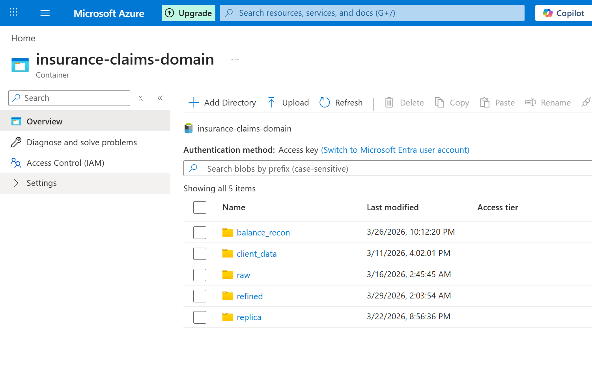
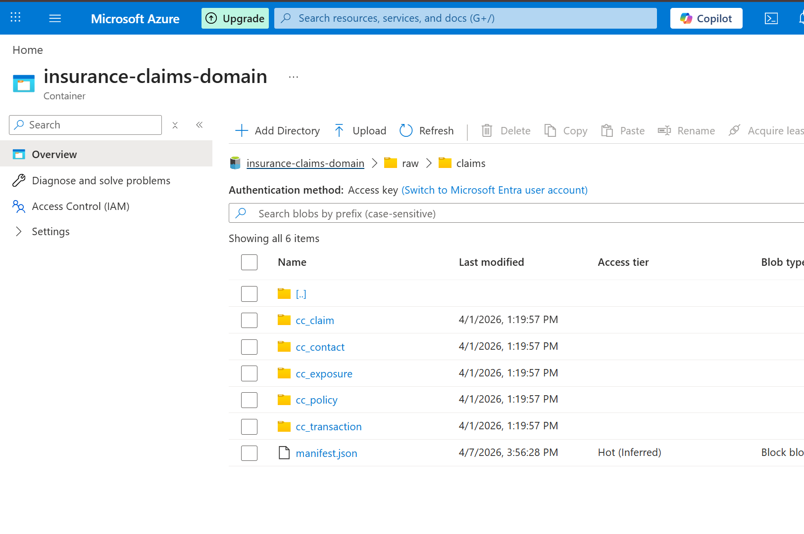
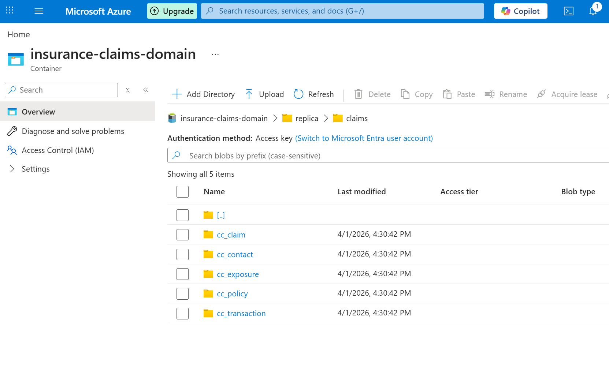
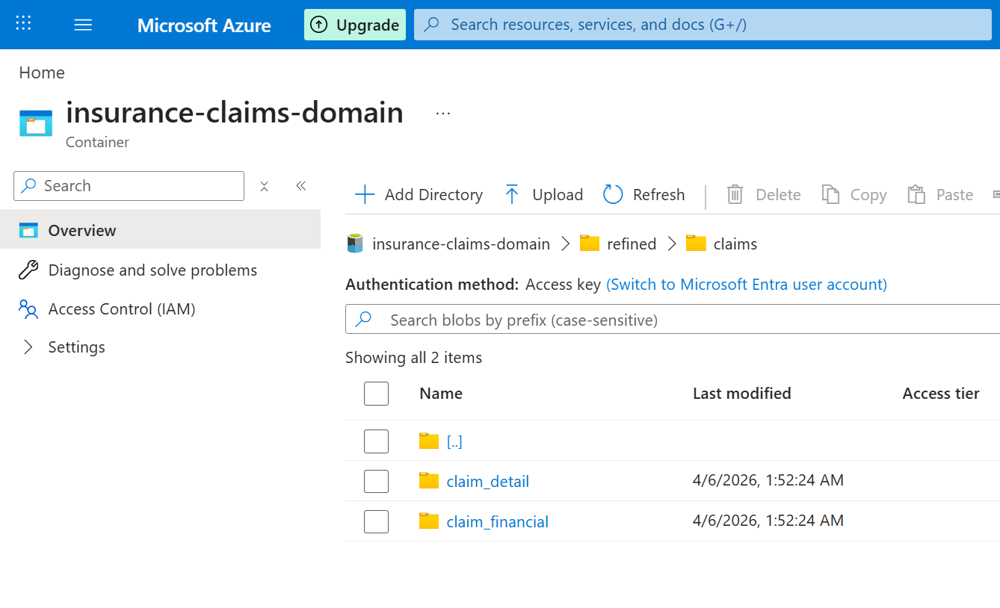
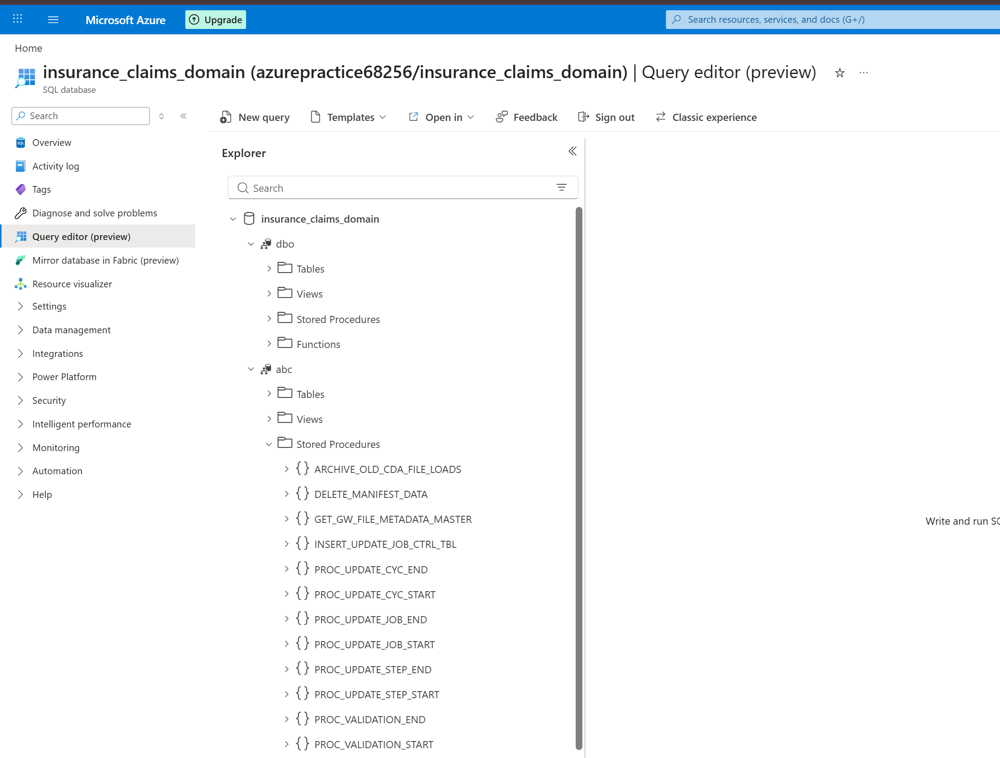

# Project Guide

---

## 1. Purpose

This project is a **hands-on learning environment** that mirrors the real Production Environment
Guidewire CDA Claims pipeline but at a much smaller scale — 5 tables instead of 813, simulated S3 data instead of real Guidewire CDA AWS S3 data.

The goal is to understand and build every layer of the pipeline end-to-end:
S3 (simulated) → Raw → Replica → Refined → Analytics

---

## 2. How It Relates to the Real Project

| Aspect | Production Environment | This Project |
|--------|-------------|----------------------|
| Source data | AWS S3 (Guidewire CDA live feed) | ADLS `client_data/` folder (simulated) |
| Tables | 813 (cc_*, cctl_*, ccx_*) | 5 (cc_policy, cc_claim, cc_exposure, cc_contact, cc_transaction) |

---

## 4. Data Flow

```
ADLS client_data/          (simulated S3 — s3_data_generator notebook)
       │
       ▼
Manifest Notebooks (4)     (copy manifest.json, parse, detect new files, populate CDA_FILE_LOADS)
       │
       ▼
ADLS raw/                  (parquet files copied from source client data
                            this is like a staging layer, no tables registered)
       │
       ▼
ADLS replica/              (external Delta tables, CDC MERGE + dedup)
Unity Catalog: insurance_claims_domain.replica.*
       │
       ▼
ADLS refined/              (external Delta tables, SCD Type 2 MERGE)
Unity Catalog: insurance_claims_domain.refined.*
       │
       ▼
Analytics / Reporting      (views + aggregated tables -> Not created in our project)
Unity Catalog: insurance_claims_domain.analytics.*
```

---

## 5. Manifest Notebooks — Why 4 and Not 1

The manifest stage is split into 4 notebooks, mirroring the production pipeline exactly. These 4 notebooks are all about the manifest phase only. The actual parquet copy is done downstream.

### Why production uses 4

| Reason | Detail |
|--------|--------|
| **Scale** | 813 tables — processing all in one notebook risks timeouts and memory pressure |
| **S3 separation** | Part 0 handles S3 network I/O separately so a slow S3 response doesn't block processing logic |
| **Independent retry** | If Part 2 fails, ADF can retry just that notebook without re-copying the manifest from S3 |
| **ADF visibility** | 4 separate activities in ADF means you can pinpoint exactly which part failed in the monitoring view |

### Why this project also uses 4

Although we only have 5 tables, we deliberately mirror the 4-notebook structure because:
- The goal is to learn and replicate the real production pattern, not just get the data moved
- It teaches how to split responsibilities across notebooks and wire them in ADF
- Each notebook's purpose is clear and isolated — easier to debug independently

### The 4 notebooks and their responsibilities

| Notebook | Name | Purpose |
|----------|------|---------|
| Part 0 | `01 Copy Manifest File from Source to ADLS` | Copy `manifest.json` from `client_data/` (simulated S3/ Cleint owned S3) to `raw/claims/`(Our owned ADLS container) |
| Part 1 | `02 Load Manifest Data to Azure SQL` | Read `manifest.json` from `raw/`, parse each table entry, load into `abc.MANIFEST`, call `GET_GW_FILE_METADATA_MASTER` to update `abc.TABLE_LOAD_METADATA` |
| Part 2 | `03 Detect and List Files to Load` | Determine full vs incremental load, list parquet file paths from ADLS, stage in global temp view `TEMP_FILE_INFO_TABLE` for notebook 04 |
| Part 3 | `04 Populate CDA_FILE_LOADS Table` | Registers every new parquet file that needs to be loaded. Takes the file list from notebook 03 and saves it into `abc.CDA_FILE_LOADS` — one row per file with `IS_LOADED=0`. The Src→Raw notebook reads this table to know which files to copy into the raw zone. |

### Notebook 01 — Design Notes

**Parameters:** Only 3 widgets declared — only what is actually used:

| Widget | Purpose |
|--------|---------|
| `ADLS_RAW_PATH` | Destination root path in ADLS raw zone |
| `TYPE_DATA` | Subfolder name under raw/ (e.g. `claims`). Production also has `contact_manager` under raw/ so this parameter makes the notebook reusable across both pipelines. In this project it will always be `claims` but is kept as a parameter to mirror production. |
| `CLIENT_DATA_PATH` | Source path -- ADLS client_data/ (our simulated S3) |

**Idempotency:** Safe to rerun any number of times. `dbutils.fs.cp` overwrites the destination file each time — same `manifest.json` is re-copied, no duplicates, no side effects. If ADF retries due to a transient failure, the result is identical.

### Notebook 02 — Design Notes

**File:** `02 Load Manifest Data to Azure SQL.ipynb`

**Parameters:** 5 widgets — all passed from ADF pipeline:

| Widget | Purpose |
|--------|---------|
| `ADLS_RAW_PATH` | Root path of raw zone — used to locate `manifest.json` |
| `TYPE_DATA` | Subfolder under raw/ (e.g. `claims`). Kept as parameter to mirror production which uses the same notebook for `claims` and `contact_manager`. |
| `XCENTER` | Source system identifier (e.g. `CC` = ClaimCenter). Used to tag MANIFEST rows and scope the DELETE before re-insert. In production the same notebook runs for both CC and CM — ADF passes the correct value each time. In this project we only use CC. |
| `CYC_SK` | Cycle identifier — used to look up `CYC_CUR_RUN_SK` from `CYC_CTRL_TBL`. |
| `ASQL_SCHEMA` | Azure SQL schema name for all ABC metadata tables (always `abc`). Production uses `config_schema`; same purpose. |

**Azure SQL connection:** Hardcoded (no Key Vault in this environment). Production fetches credentials from Key Vault via `dbutils.secrets.get()`.

| Field | Value |
|-------|-------|
| Server | `azurepractice68256.database.windows.net` |
| Database | `insurance_claims_domain` |
| Username | `rcmadmin` |

**Execution flow:**
```
1. GET    CYC_CUR_RUN_SK from CYC_CTRL_TBL for CYC_SK
          → raises ValueError if not found (cycle not started)

2. EXEC   DELETE_MANIFEST_DATA(xcenter)
          → clears previous MANIFEST rows for this XCENTER

3. READ   ADLS_RAW_PATH/TYPE_DATA/manifest.json (multiline JSON)
          → each top-level key is one table entry

4. PARSE  each table struct into flat rows, stringify schemaHistory

5. WRITE  all rows to abc.MANIFEST (JDBC append)
          → tagged with XCENTER, AUDIT_DT_TM, CYC_RUN_SK

6. EXEC   GET_GW_FILE_METADATA_MASTER(CDA_STAGE_URL, xcenter, cyc_run_sk)
          → updates abc.TABLE_LOAD_METADATA
```

**`CYC_RUN_SK` — not a DB-enforced FK:** The column exists in MANIFEST and TABLE_LOAD_METADATA as a logical reference only — no `FOREIGN KEY` constraint is defined. This is intentional: pipeline metadata tables avoid hard FK constraints to prevent failures on reruns or out-of-order writes.

**Idempotency:** Safe to rerun. `DELETE_MANIFEST_DATA` runs first and wipes all MANIFEST rows for the current XCENTER before re-inserting — so MANIFEST always ends up with exactly the current run's 5 rows regardless of how many times it runs. `GET_GW_FILE_METADATA_MASTER` is an UPDATE not an INSERT, so it overwrites TABLE_LOAD_METADATA in place. One caveat: repeated reruns within the same pipeline cycle will keep shifting LATEST→PREVIOUS, meaning PREVIOUS gets overwritten each time — but since the values always come from the same manifest.json in that run, the final state is the same.

---

### `DELETE_MANIFEST_DATA` — Stored Procedure Logic

**Called by:** Notebook 02, before re-inserting rows from `manifest.json`
**Parameter:** `@XCENTER VARCHAR(10)`

Deletes all rows from `abc.MANIFEST` where `XCENTER = @XCENTER`. Uses a filtered DELETE (not `TRUNCATE TABLE`) so only the current XCENTER's rows are removed — other XCENTERs (e.g. CM) are untouched.

---

### `GET_GW_FILE_METADATA_MASTER` — Stored Procedure Logic

**Called by:** Notebook 02, after MANIFEST is populated
**Parameters:** `@CDA_STAGE_URL VARCHAR(500)`, `@XCENTER VARCHAR(10)`, `@CYC_RUN_SK INT`

For every table in `abc.MANIFEST` filtered by `@XCENTER`, joins to `abc.TABLE_LOAD_METADATA` on table name (extracted from `DATAFILESPATH` as the last `/`-delimited segment):
1. Shifts `LATEST_*` → `PREVIOUS_*` (timestamps and fingerprints)
2. Writes new `LATEST_LASTSUCCESSFULWRITETIMESTAMP` from MANIFEST
3. Extracts `LATEST_FINGERPRINT` — first 32-char hex key from the `SCHEMAHISTORY` string
4. Sets `LOAD_STATUS = 'C'`, updates `UPDATE_DATE_TIME`, writes `CYC_RUN_SK`

`@CDA_STAGE_URL` is accepted to match the production signature but is not used in query logic — the path is already stored in `MANIFEST.DATAFILESPATH`.

---

### `CDA_FILE_LOADS` — Table Details

One row per parquet file discovered in `client_data/`. Populated by manifest notebook Part 3.

| Column | Type | Notes |
|--------|------|-------|
| `FILE_LOAD_ID` | `INT IDENTITY(1,1)` | Auto-increment PK — gaps are normal (identity across multiple runs) |
| `TABLE_NAME` | `VARCHAR(100)` | Lowercase (e.g. `cc_claim`) |
| `GW_FINGERPRINT` | `VARCHAR(32)` | 32-char MD5 hash matching the ADLS folder name |
| `GW_TIMESTAMP` | `VARCHAR(50)` | Unix epoch ms — matches the timestamp folder in ADLS |
| `CLOUD_PATH` | `VARCHAR(500)` | Relative path: `table_name/fingerprint/timestamp` |
| `IS_LOADED` | `BIT DEFAULT 0` | 0 = file discovered, not yet copied to raw; 1 = copied |
| `IS_FINGERPRINT_UPDATED` | `BIT DEFAULT 0` | 1 = schema fingerprint changed vs previous run |
| `INSERT_DATE_TIME` | `DATETIME2` | When the row was first written |
| `UPDATE_DATE_TIME` | `DATETIME2` | When IS_LOADED or IS_FINGERPRINT_UPDATED was last changed |
| `XCENTER` | `VARCHAR(10)` | e.g. `CC` |
| `CYC_RUN_SK` | `INT` | Logical reference to CYC_RUN_TBL — not DB-enforced |

**Full load vs incremental:** When `CDA_FILE_LOADS` is empty (`count = 0`), Part 2 treats it as a full load and lists all files. On subsequent runs, only files with timestamps newer than `MAX(GW_TIMESTAMP)` per table are added.

---

### Notebook 03 — Design Notes

**File:** `03 Detect and List Files to Load.ipynb`

**Parameters:** 4 widgets — all passed from ADF pipeline:

| Widget | Purpose |
|--------|---------|
| `CLIENT_DATA_PATH` | ADLS source zone (our simulated S3). Production equivalent: `BUCKET` + `ext_s3_path` pointing to S3. |
| `XCENTER` | Source system identifier. Used to filter all Azure SQL queries to the correct source system. |
| `CYC_SK` | Cycle identifier. Used to look up `CYC_CUR_RUN_SK` — present to match production, not written to the output temp view. |
| `ASQL_SCHEMA` | Azure SQL schema name for all ABC metadata tables. |

**Execution flow:**
```
1. GET    CYC_CUR_RUN_SK from CYC_CTRL_TBL (matches production -- not used in output)

2. READ   TABLE_LOAD_METADATA  --> temp view  (latest/previous timestamps per table)
   READ   CDA_FILE_LOADS       --> temp view + count  (determines full vs incremental)
   READ   MANIFEST             --> temp view  (extract table name from DATAFILESPATH)
          expand schemaHistory  --> MANIFEST_EXPANDED temp view  (table + fingerprint rows)

3. IF cfl_count == 0  (FULL LOAD -- first ever run):
       dbutils.fs.ls(CLIENT_DATA_PATH/{table}/{fingerprint}/)
       --> all timestamp folders for every table/fingerprint

   ELSE  (INCREMENTAL):
       SQL: find tables where LATEST_TS > MAX(GW_TIMESTAMP in CDA_FILE_LOADS)
       dbutils.fs.ls per table, filter ts > PREVIOUS_LASTSUCCESSFULWRITETIMESTAMP
       --> only new timestamp folders

4. PARSE  file_list paths into TABLE_NAME / GW_FINGERPRINT / GW_TIMESTAMP / CLOUD_PATH
          .distinct() + add XCENTER column

5. STAGE  global temp view TEMP_FILE_INFO_TABLE  (consumed by notebook 04)
```

**Key production differences:**

| | Production | This Project |
|--|-----------|-------------|
| File listing | boto3 S3 paginator with `StartAfter` | `dbutils.fs.ls()` on ADLS |
| Parallel listing | `ThreadPoolExecutor` (10 workers) | Sequential — 5 tables, not needed |
| schemaHistory expansion | Only for incremental (boto3 full load lists everything blind) | Always — `dbutils.fs.ls()` needs explicit paths |
| `manifest.json` filter | Explicitly excluded from file list | Not needed — `dbutils.fs.ls()` on timestamp subfolder never returns root files |

**No data is read at this stage.** The notebook operates purely at the file path level — parquet contents are not touched until the Src→Raw notebook.

**Idempotency:** Safe to rerun. The notebook only reads from Azure SQL and writes to a global temp view (in-memory, not persisted). Each rerun simply replaces the temp view. One important behaviour: if notebook 04 has already run and `CDA_FILE_LOADS` has rows, a rerun of notebook 03 switches to **incremental mode** and only lists files newer than what is already in `CDA_FILE_LOADS`. To force a full re-list, `CDA_FILE_LOADS` would need to be cleared first.

---

### Notebook 04 — Design Notes

**File:** `04 Populate CDA_FILE_LOADS.ipynb`

**In plain English:** Registers every new parquet file that needs to be loaded into the pipeline. Notebook 03 found which files exist in ADLS — this notebook saves that list into `abc.CDA_FILE_LOADS`, one row per file, marking each as not yet loaded (`IS_LOADED=0`). The Src→Raw notebook reads this table to know exactly which files to copy into the raw zone.

**Parameters:** 3 widgets — all passed from ADF pipeline:

| Widget | Purpose |
|--------|---------|
| `XCENTER` | Source system identifier. Used to scope Azure SQL queries and tag `CDA_FILE_LOADS` rows. |
| `CYC_SK` | Cycle identifier. `cyc_run_sk` is looked up and written into every `CDA_FILE_LOADS` row as `CYC_RUN_SK` — unlike notebook 03 where it was read but not used in the output. |
| `ASQL_SCHEMA` | Azure SQL schema name for all ABC metadata tables. |

**Execution flow:**
```
1. GET    CYC_CUR_RUN_SK from CYC_CTRL_TBL
          --> written into every CDA_FILE_LOADS row as CYC_RUN_SK

2. READ   TABLE_LOAD_METADATA  --> temp view
   READ   CDA_FILE_LOADS       --> temp view

3. JOIN   global_temp.TEMP_FILE_INFO_TABLE  (from notebook 03)
          INNER JOIN TABLE_LOAD_METADATA WHERE LOAD_STATUS = 'I'
          --> only tables with new data detected this run
          LEFT JOIN CDA_FILE_LOADS WHERE FILE_LOAD_ID IS NULL
          --> anti-join: skip files already registered

4. WRITE  result to abc.CDA_FILE_LOADS (JDBC append)
          IS_LOADED defaults to 0 -- set to 1 by Src->Raw after files are copied
```

**`LOAD_STATUS = 'I'` dependency:**
`GET_GW_FILE_METADATA_MASTER` (called in notebook 02) sets `LOAD_STATUS = 'I'` in `TABLE_LOAD_METADATA` for every table with newly detected data. Without this, the `INNER JOIN WHERE LOAD_STATUS = 'I'` filter would produce zero rows and nothing would be inserted. `LOAD_STATUS` is reset to `'C'` by the Src→Raw notebook after files are successfully copied.

**Idempotency:** Safe to rerun. The LEFT JOIN + `WHERE FILE_LOAD_ID IS NULL` anti-join prevents duplicate rows — any file already in `CDA_FILE_LOADS` is automatically excluded. If notebook 03 was run in the same Spark session, `TEMP_FILE_INFO_TABLE` is still available. If the session restarted, notebook 03 must be rerun first to re-stage the temp view.

---

### Manifest Stage — End-to-End Flow

```
ADF triggers pipeline
        │
        ▼
Notebook 01   dbutils.fs.cp: client_data/manifest.json --> raw/claims/manifest.json

        │
        ▼
Notebook 02   DELETE abc.MANIFEST where XCENTER='CC'
              Read raw/claims/manifest.json, parse 5 table entries
              INSERT 5 rows into abc.MANIFEST  (one per table)
              EXEC GET_GW_FILE_METADATA_MASTER
                  --> shifts LATEST to PREVIOUS in TABLE_LOAD_METADATA
                  --> writes new timestamps + fingerprints
                  --> sets LOAD_STATUS = 'I'  (new data ready)

        │
        ▼
Notebook 03   Read TABLE_LOAD_METADATA, CDA_FILE_LOADS, MANIFEST from Azure SQL
              IF CDA_FILE_LOADS empty  --> Full load: list ALL timestamp folders
              ELSE                     --> Incremental: list only new timestamp folders
              Parse paths into TABLE_NAME / GW_FINGERPRINT / GW_TIMESTAMP / CLOUD_PATH
              Stage in global_temp.TEMP_FILE_INFO_TABLE  (in-memory, Spark session only)

        │
        ▼
Notebook 04   Read TEMP_FILE_INFO_TABLE + TABLE_LOAD_METADATA + CDA_FILE_LOADS
              Anti-join: keep only files not yet in CDA_FILE_LOADS
              INSERT into abc.CDA_FILE_LOADS  (IS_LOADED=0, CYC_RUN_SK tagged)

        │
        ▼
Src->Raw      Reads abc.CDA_FILE_LOADS where IS_LOADED=0
              Copies each parquet from client_data/ --> raw/
              Sets IS_LOADED=1, LOAD_STATUS='C' after copy
```

---

## 5b. Raw → Replica Stage

### Notebook 07 — Design Notes

**File:** `07 Copy ADLS Raw Parquet to Replica External Delta Tables.ipynb`

**In plain English:** Reads each table's parquet files from `raw/`, deduplicates rows using GW CDC keys, splits on operation code, and MERGEs changes into an external Delta table in the `replica` layer. On first run it creates the Delta table from scratch; on subsequent runs it performs an incremental MERGE. Soft-deleted records (operation=1) are never physically removed — a `Soft_Delete='Y'` flag is set instead.

**Parameters (ADF notebook activity widgets):**

| Widget | Purpose |
|--------|---------|
| `TABLE_NAME` | Lowercase table name e.g. `cc_claim`. In ADF: `@item().TGT_FILE_TBL` from `TABLES_TO_LOAD_RPL`. |
| `TYPE_DATA` | Subfolder under raw/ (always `claims` in this project). Matches production multi-pipeline pattern. |
| `XCENTER` | Source system identifier (`CC`). Tags audit columns and ABC metadata rows. |
| `ASQL_SCHEMA` | Azure SQL schema for ABC metadata tables (always `abc`). |
| `CYC_SK` | Cycle identifier. Used to look up `CYC_CUR_RUN_SK` at runtime. |
| `CYC_RUN_SK` | Cycle run surrogate key — written into every replica row as an audit column. Passed from ADF (output of `PROC_UPDATE_CYC_START`). |
| `ADLS_RAW_PATH` | Root of raw zone: `abfss://insurance-claims-domain@azurepractice68256.dfs.core.windows.net/raw` |
| `ADLS_REPLICA_PATH` | Root of replica zone: `abfss://insurance-claims-domain@azurepractice68256.dfs.core.windows.net/replica` |
| `Processed_DB` | Unity Catalog catalog name: `insurance_claims_domain` |
| `Processed_Schema` | Unity Catalog schema name: `replica` |

**Execution flow:**
```
1. SET    spark.conf autoMerge + storage key

2. READ   TABLES_TO_LOAD_RPL from Azure SQL
          → gets GW_FINGERPRINT + GW_TIMESTAMP for this table

3. READ   raw parquet:  {ADLS_RAW_PATH}/{TYPE_DATA}/{table}/*/*/*.parquet
          → wildcard covers all fingerprint/timestamp subfolders for this table

4. ADD    audit columns: CYC_RUN_SK, GW_FINGERPRINT, GW_TIMESTAMP, ABC_AUDIT_DATE_TIME,
                         Validation_Flag='Y', Soft_Delete='N'
          → GW_FINGERPRINT / GW_TIMESTAMP parsed from file path (reverse split)

5. DEDUP  ROW_NUMBER OVER (PARTITION BY id
                           ORDER BY GW_TIMESTAMP DESC,
                                    gwcbi___payload_ts_ms DESC,
                                    gwcbi___seqval_hex DESC) → keep rank=1

6. SPLIT  df_inserts  = rows where gwcbi___operation IN (0, 2, 4)
          df_deletes  = rows where gwcbi___operation = 1

7. IF table does not exist in Unity Catalog:
       INITIAL LOAD
       a. Write df_inserts to ADLS replica path (Delta format, overwrite)
       b. Register external table:
          CREATE TABLE IF NOT EXISTS {DB}.{schema}.{table}
          USING DELTA LOCATION '{replica_path}/{table}'
       c. Soft deletes: UPDATE replica table SET Soft_Delete='Y'
          WHERE id IN (SELECT id FROM df_deletes view)
   ELSE:
       INCREMENTAL LOAD (foreach fingerprint/timestamp folder in RAW_TABLE_LOAD):
       a. Read one parquet folder → dedup → split inserts/deletes
       b. MERGE into replica Delta table:
          ON s.id = t.id
          WHEN MATCHED    → updateAll
          WHEN NOT MATCHED → insertAll
       c. Soft deletes: UPDATE SET Soft_Delete='Y'
          WHERE id IN (SELECT id FROM deleted_view)
       Accumulate per-folder counts → sum for exit metrics

8. METRICS
       ROWS_READ     = total raw parquet rows (before dedup)
       ROWS_INSERTED = new rows (not matched by MERGE)
       ROWS_UPDATED  = matched rows (updated by MERGE)
       ROWS_DELETED  = operation=1 rows (soft-deleted)
       ROWS_DUPLICATE = ROWS_READ - (ROWS_INSERTED + ROWS_UPDATED + ROWS_DELETED)
       ROWS_LOADED   = ROWS_INSERTED + ROWS_UPDATED + ROWS_DELETED
       Reconciliation: ROWS_READ == ROWS_LOADED + ROWS_DUPLICATE  ✓

9. EXIT   dbutils.notebook.exit(json.dumps({
              "STATUS": "Success",
              "ROWS_READ": ..., "ROWS_LOADED": ...,
              "ROWS_INSERTED": ..., "ROWS_UPDATED": ..., "ROWS_DELETED": ...
          }))
```

**Key design decisions:**

| Decision | Reason |
|----------|--------|
| External Delta tables (not managed) | Files live in ADLS `replica/` — `DROP TABLE` in UC only removes the pointer, never deletes ADLS data. Matches production pattern. |
| `CREATE TABLE IF NOT EXISTS` on first run only | `spark.catalog.tableExists()` guards the CREATE — subsequent runs skip it entirely. |
| `autoMerge = true` | Handles GW CDA schema evolution — new columns in a future fingerprint are automatically merged into the existing Delta table schema. |
| Soft delete instead of physical delete | GW CDA operation=1 is a before-image (the row as it was before deletion). Keeping it with `Soft_Delete='Y'` preserves history and matches production behaviour. |
| ROWS_READ from raw parquet, not MANIFEST | This project has no `MANIFEST_ARCHIVE` table. Production reads from there; here we count directly from the raw parquet DataFrame. |
| Storage key via `spark.conf.set()` | Consistent with all other notebooks. (RCM project uses `sc._jsc.hadoopConfiguration()` — different environment.) |

**Unity Catalog prerequisite (one-time, already done):**
```sql
CREATE SCHEMA IF NOT EXISTS insurance_claims_domain.replica;
```
The individual tables are created automatically by this notebook on first run.

---

## 6. ADF Global Parameters

### Failure Notification Email — Why Global, Not Pipeline-Specific

The failure notification email is defined as an **ADF Global Parameter** (factory level) rather than a pipeline-level parameter.

| | Global Parameter | Pipeline Parameter |
|--|----------------|--------------------|
| **Scope** | Entire factory — all pipelines | One pipeline only |
| **Update** | Change once, applies everywhere | Must update every pipeline individually |
| **Use case** | Cross-cutting config (ops email, env name) | Business logic inputs that vary per run |

**Why global for the email:**
- The same ops team monitors all pipelines — one email address applies factory-wide
- If the address changes, you update it in one place (factory settings), not in every pipeline
- Failure notification is infrastructure config, not pipeline business logic

**When pipeline-specific would make sense:**
- Different pipelines need to alert different teams
- The email needs to be overridden per run by a scheduler

### Email Alerting via Logic Apps

Failure notifications are delivered through an **Azure Logic App**, not from within ADF directly. ADF has a WebActivity on every failure path that calls the Logic App's HTTP endpoint. The Logic App then sends a formatted email to the operations team.

This separation of concerns keeps the notification logic out of ADF pipelines and out of Databricks notebooks — the email endpoint is just a URL stored as a global parameter. In production (`adf-claims-prod-eastus-001`) this pattern covers both the Claims and Contact Manager pipelines, so any failure anywhere in either pipeline triggers the same ops team email.

---

## 7. ADLS Folder Structure

```
azurepractice68256  (storage account)
└── insurance-claims-domain/                      ← container
    │
    ├── client_data/                              ← simulated S3 landing zone
    │   ├── manifest.json                         ← overwritten each run, cumulative counts
    │   ├── cc_policy/
    │   │   └── d09aa4813a023e95abb3386e67be1408/ ← fingerprint (MD5 of schema version)
    │   │       ├── 1772378931503/                ← run 1 timestamp folder (never deleted)
    │   │       │   └── part-00000.snappy.parquet
    │   │       └── 1772381234567/                ← run 2 timestamp folder (appended)
    │   │           └── part-00000.snappy.parquet
    │   ├── cc_claim/
    │   │   └── f0a7604049cecc6facff72cad2e0d6cb/
    │   │       ├── 1772378931503/
    │   │       │   └── part-00000.snappy.parquet
    │   │       └── 1772381234567/
    │   │           └── part-00000.snappy.parquet
    │   ├── cc_exposure/
    │   │   └── b8ff2d6cb2ee05423e6e8ca738c5316d/
    │   │       └── {timestamp}/part-00000.snappy.parquet
    │   ├── cc_contact/
    │   │   └── 10e87b0b056a2e4caa0bf5481c31ed6b/
    │   │       └── {timestamp}/part-00000.snappy.parquet
    │   └── cc_transaction/
    │       └── 278154176ec005dd5ed27674ee531572/
    │           └── {timestamp}/part-00000.snappy.parquet
    │
    ├── raw/                                      ← raw zone (pipeline copies here from client_data)
    │   ├── cc_policy/{fingerprint}/{timestamp}/
    │   ├── cc_claim/{fingerprint}/{timestamp}/
    │   ├── cc_exposure/{fingerprint}/{timestamp}/
    │   ├── cc_contact/{fingerprint}/{timestamp}/
    │   └── cc_transaction/{fingerprint}/{timestamp}/
    │
    ├── replica/                                  ← Delta tables (CDC MERGE)
    │   ├── cc_policy/     (_delta_log/ + *.parquet)
    │   ├── cc_claim/
    │   ├── cc_exposure/
    │   ├── cc_contact/
    │   └── cc_transaction/
    │
    └── refined/                                  ← Delta tables (SCD Type 2)
        ├── claim_detail/
        ├── claim_financial/
        └── ...
```

**ADLS storage screenshots (from the actual Azure environment):**






### Key Concepts

#### Fingerprint
The fingerprint is a **32-character MD5 hex string** computed from the table's schema definition.
It acts as a schema version identifier — it stays the same across every run as long as the
columns don't change, and only changes when the schema changes.

**Why it exists:**
In the real GW CDA pipeline, Guidewire re-hashes the schema on every delivery. If the hash
changes, it means columns were added/removed/renamed. The pipeline uses this to detect schema
drift — new fingerprint = new schema version, which may need DDL changes before the data
can be loaded.

**How it's used in the folder path:**
```
client_data/{table}/{fingerprint}/{timestamp}/part-00000.snappy.parquet
```
The fingerprint sits between the table name and the timestamp. If a schema change happens
mid-history, you'd see two different fingerprint folders under the same table:
```
cc_claim/
  f0a7604049cecc6facff72cad2e0d6cb/   ← original schema (v1)
  │   └── {old timestamps}/
  a3b9c12d.../                         ← new schema (v2) — different fingerprint
      └── {new timestamps}/
```

**How it's generated in this notebook:**
```python
fingerprints = {t: hashlib.md5(f"{t}_schema_v1".encode()).hexdigest() for t in TABLES}
```
The string `"cc_claim_schema_v1"` is hashed → always produces the same value (`f0a7604049cecc6facff72cad2e0d6cb`).
To simulate a schema change, change `_schema_v1` to `_schema_v2` — a new fingerprint folder
will be created and `manifest.json` will gain a second entry in `schemaHistory`.

**Fingerprints for the 5 tables (stable, never change unless you change `_schema_v1`):**

| Table | Fingerprint |
|-------|-------------|
| `cc_policy` | `d09aa4813a023e95abb3386e67be1408` |
| `cc_claim` | `f0a7604049cecc6facff72cad2e0d6cb` |
| `cc_exposure` | `b8ff2d6cb2ee05423e6e8ca738c5316d` |
| `cc_contact` | `10e87b0b056a2e4caa0bf5481c31ed6b` |
| `cc_transaction` | `278154176ec005dd5ed27674ee531572` |

#### Other Key Concepts
| Concept | Explanation |
|---------|-------------|
| **Timestamp** | Unix epoch milliseconds — when the data was delivered. New folder every run. |
| **Append-only** | Old timestamp folders are NEVER deleted. Each run adds a new folder. |
| **manifest.json** | Single file at `client_data/` root. Tracks schema history + cumulative record counts per table. |

---

## 8. manifest.json Behaviour

`manifest.json` is a single JSON file written at `client_data/manifest.json`. It is
**overwritten on every run** but with accumulated values — it is not a log, it is a
current-state summary. The downstream manifest notebook reads this file to know which
tables have new data and which timestamp folders to load.

**Example after 3 runs (100 rows each):**
```json
{
  "CC_CLAIM": {
    "dataFilespath": "CC/CC_CLAIM",
    "lastSuccessfulWriteTimestamp": "1772381234567",   ← replaced every run (latest only)
    "schemaHistory": {
      "f0a7604049cecc6facff72cad2e0d6cb": "1772378931503"  ← fingerprint: first-seen timestamp
    },
    "totalProcessedRecordsCount": "300"               ← cumulative: 100 + 100 + 100
  }
}
```

| Field | Behaviour | Why |
|-------|-----------|-----|
| `dataFilespath` | Static — always `CC/{TABLE}` | Matches real GW CDA S3 path format |
| `lastSuccessfulWriteTimestamp` | **Replaced** — current run timestamp | Points pipeline to the latest folder to load |
| `schemaHistory` | **Accumulated** — `{fingerprint}: {first_seen_ts}`, never removed | Tracks all schema versions ever seen; new fingerprint = schema changed |
| `totalProcessedRecordsCount` | **Cumulative** — adds this run's non-deleted rows | Running total of all records delivered across all runs |

**How `schemaHistory` connects to the folder structure:**
The key in `schemaHistory` is the same fingerprint used as the folder name in ADLS.
So to find the actual data files for a given schema version:
```
client_data/cc_claim/{fingerprint from schemaHistory}/{any timestamp}/part-00000.snappy.parquet
```
If a schema change happened mid-history, `schemaHistory` will have two entries — one per
fingerprint — and there will be two separate fingerprint folders in ADLS.

---

## 9. Unity Catalog Layout

### Production vs Mini-Project Schema Naming

The production environment and this mini-project use **different catalog and schema names** for the same logical layers:

| Layer | Production | This Project |
|-------|-----------|-------------|
| Catalog | `dbw_claims_prod_eastus_001` | `insurance_claims_domain` |
| Replica schema | `cda_replica_claims` | `replica` |
| Refined schema | `cda_refined_claims` | `refined` |
| Analytics schema | `slide_analytics` | `analytics` |

The code patterns, MERGE logic, SCD2 columns, and metadata framework are identical. Only the names change.

```
insurance_claims_domain          ← catalog
├── s3_data                      ← schema: simulator support only
│   └── generator_state          ← tracks generated IDs for CDC simulation
│
├── replica                      ← schema: replica layer (external Delta tables, created by notebook 07)
│   ├── cc_policy
│   ├── cc_claim
│   ├── cc_exposure
│   ├── cc_contact
│   └── cc_transaction
│
├── refined                      ← schema: refined layer (external Delta tables, SCD Type 2, created by notebook 12)
│   ├── claim_detail
│   └── claim_financial
│
└── analytics                    ← schema: analytics layer (views + snapshots — TODO)
    └── ...
```

### Manual Prerequisites — What Must Be Done Before the First Pipeline Run

The notebooks (`07`, `12`) create Delta tables and register them in Unity Catalog automatically. But Unity Catalog enforces two infrastructure rules that **no notebook can bypass** — they must be set up manually once before the first run.

---

#### Why the Notebook Cannot Do This Itself

| Requirement | Why a notebook can't handle it |
|-------------|-------------------------------|
| Schema creation | `CREATE SCHEMA` requires the calling principal to have `CREATE SCHEMA` privilege on the catalog. Notebooks run as the cluster's service principal — in this environment, its is not granted by default. More importantly, schemas are **infrastructure**, not pipeline logic — they are set up once and never touched again by the pipeline. |
| External location | Unity Catalog rejects `CREATE TABLE ... USING DELTA LOCATION 'abfss://...'` if the ADLS path is not covered by a registered external location. The notebook cannot register external locations — that is a Unity Catalog admin operation. |
| IAM role on storage | The managed identity backing the external location must have `Storage Blob Data Contributor` on the storage account. This is an Azure Portal operation — no SDK call from within a notebook can grant Azure RBAC roles. |

---

#### Step 1 — Grant IAM Role (Azure Portal)

The Unity Catalog managed identity (`unity-catalog-access-connector`) must have **Storage Blob Data Contributor** on `azurepractice68256`.

1. **Azure Portal → Storage accounts → azurepractice68256**
2. **Access Control (IAM) → Add role assignment**
3. Role: `Storage Blob Data Contributor`
4. Assign to: **Managed Identity → Access Connector for Azure Databricks** → select `unity-catalog-access-connector` (in RG `databricks-rg-azurepractice68256-gjlwqw7298rxt`)
5. **Review + assign**

> Wait 1–2 minutes for the role assignment to propagate before proceeding.

---

#### Step 2 — Create External Location (Databricks UI)

Unity Catalog needs a registered external location covering the `insurance-claims-domain` container before any external table can be created inside it.

**Catalog → External Data → External Locations → Create Location**

| Field | Value |
|-------|-------|
| Name | `insurance_claims_domain` |
| URL | `abfss://insurance-claims-domain@azurepractice68256.dfs.core.windows.net/` |
| Storage credential | `azurepractice68256_7405605623178961` |

Click **Test Connection** — Read, List, Write, Delete should all pass.
The two "File Events" checks (EventGrid queue) will fail — that is expected and harmless for this batch pipeline.
Click **Create**.

> **Note:** "File Events" failures are for streaming file notifications (EventGrid). This pipeline is batch — ADF triggers notebooks on a schedule. File Events are not needed and can be ignored.

---

#### Step 3 — Create Schemas (Databricks notebook or SQL editor)

Run once in any notebook attached to the `Compute` cluster:

```sql
CREATE SCHEMA IF NOT EXISTS insurance_claims_domain.replica;
CREATE SCHEMA IF NOT EXISTS insurance_claims_domain.refined;
```

Or via Python:
```python
spark.sql("CREATE SCHEMA IF NOT EXISTS insurance_claims_domain.replica")
spark.sql("CREATE SCHEMA IF NOT EXISTS insurance_claims_domain.refined")
```

---

#### Step 4 — Restart the Compute Cluster

After creating the external location, **restart the cluster** so it picks up the new credential binding. New external locations are not visible to a cluster that was started before they were created.

**Databricks UI → Compute → Compute → Restart**

---

#### What the Notebooks Do Automatically (no manual action needed)

Once the above prerequisites are in place, the notebooks handle everything else:

| Action | Notebook | When |
|--------|----------|------|
| Write Delta files to ADLS `replica/` | `07` | Every run (initial + incremental) |
| `CREATE TABLE IF NOT EXISTS ... USING DELTA LOCATION` | `07` | Initial load only (table doesn't exist yet) |
| CDC MERGE into existing Delta table | `07` | Incremental loads |
| Write Delta files to ADLS `refined/` | `12` | Every run |
| `CREATE TABLE IF NOT EXISTS ... USING DELTA LOCATION` | `12` | Initial load only |
| SCD2 MERGE into existing refined table | `12` | Incremental loads |

The tables themselves are created automatically on first run — no table DDL needed.

### External vs Managed Tables — Replica and Refined

Both the replica and refined layers use **external Delta tables** (not managed tables).

| Aspect | Behaviour |
|--------|-----------|
| **Where data lives** | ADLS `replica/` or `refined/` — files written there by the notebook |
| **What Unity Catalog holds** | Only the metadata pointer (`USING DELTA LOCATION '...'`) |
| **DROP TABLE in UC** | Removes the pointer only — ADLS files are **never deleted** |
| **CREATE TABLE statement** | `CREATE TABLE IF NOT EXISTS ... USING DELTA LOCATION '...'` |
| **Who creates the tables** | The notebook creates them on the **initial load** (when the Delta table doesn't yet exist in UC); no DDL script needed |
| **Why not managed tables?** | Managed tables store data inside UC's default location and ARE deleted with DROP TABLE — too risky for a production pipeline where data must survive accidental UC changes |

### How Replica and Refined Tables Are Created (schema-inferred, not schema-declared)

**Key concept:** Neither notebook 07 nor notebook 12 contains an explicit column-by-column `CREATE TABLE` statement. The table schema is **inferred automatically from the DataFrame** that is written to ADLS. The `CREATE TABLE` that registers the table in Unity Catalog contains no column list at all:

```python
# What create_table() actually does — no column definitions anywhere:

# Step 1: write DataFrame to ADLS as Delta files — schema is embedded in the Delta log
df.write.format("delta").save("abfss://.../replica/claims/cc_claim/")

# Step 2: register the path in Unity Catalog — UC reads the schema from the Delta log
spark.sql(
    "CREATE TABLE IF NOT EXISTS insurance_claims_domain.replica.cc_claim "
    "USING DELTA LOCATION 'abfss://.../replica/claims/cc_claim/'"
)
```

Delta reads the schema (column names and types) from the Parquet/Delta log files that were written in Step 1, and Unity Catalog inherits that schema automatically. The columns you see when you `DESCRIBE insurance_claims_domain.replica.cc_claim` come from what was in `df` at write time — not from any DDL you wrote.

**For replica (notebook 07):** The DataFrame columns come from the source parquet files + the audit columns added by the notebook (`CYC_RUN_SK`, `GW_FINGERPRINT`, `GW_TIMESTAMP`, `ABC_AUDIT_DATE_TIME`, `Validation_Flag`, `Soft_Delete`). No DDL file exists for replica tables in this project.

**For refined (notebook 12):** The DataFrame columns come from the transformation query result + ETL SCD2 columns added by the notebook (`ETL_Key_Hash`, `ETL_SCD2_Hash`, `ETL_ActiveRow_Flag`, `ETL_RecordEffective_Date`, etc.) + the surrogate key (`claim_detail_sk` / `claim_financial_sk`).

**Why `refined_tables.ddl` exists:** Since the notebook never explicitly lists column names or types, it's useful to have a reference document that shows what the table will look like after the initial load. `refined_tables.ddl` is that document — it lists every column and type for `claim_detail` and `claim_financial`. **You do not run it.** The notebook creates the actual tables.

For replica, an equivalent reference file was not created — but the schema can always be inferred from the `s3_data_generator.ipynb` schemas (where the source parquet columns are defined) plus the audit columns notebook 07 adds.

**If UC pointer is lost (e.g. someone runs `DROP TABLE`):** ADLS files are safe. To reconnect:
```sql
-- Re-register replica table (schema comes from existing Delta files — no column list needed)
CREATE TABLE IF NOT EXISTS insurance_claims_domain.replica.cc_claim
USING DELTA LOCATION 'abfss://insurance-claims-domain@azurepractice68256.dfs.core.windows.net/replica/claims/cc_claim/';

-- Same for refined
CREATE TABLE IF NOT EXISTS insurance_claims_domain.refined.claim_detail
USING DELTA LOCATION 'abfss://insurance-claims-domain@azurepractice68256.dfs.core.windows.net/refined/claims/claim_detail/';
```

| | Replica | Refined |
|--|---------|---------|
| Created by | Notebook 07 `create_table()` on first run | Notebook 12 `create_table()` on first run |
| Schema source | Inferred from parquet + audit cols added by nb07 | Inferred from transformation query result + ETL cols added by nb12 |
| Table type | External Delta | External Delta |
| Explicit DDL file | None | `refined_tables.ddl` — reference only, not executed |
| DROP TABLE effect | Removes UC pointer; ADLS Delta files preserved | Same |

> **Production** had a separate SQL script (`Production Replica Table Creation - Refined Layer.sql`) that pre-created replica table schemas before the first run. In this practice project we skip that and let notebooks infer and create the schema from data on first run — simpler and equivalent.

### `generator_state` table — DDL

```sql
CREATE SCHEMA IF NOT EXISTS insurance_claims_domain.s3_data
COMMENT 'Holds generator state for GW CDA simulation — not part of the pipeline';

CREATE TABLE IF NOT EXISTS insurance_claims_domain.s3_data.generator_state (
    table_name    STRING  NOT NULL  COMMENT 'GW table name e.g. cc_claim',
    record_id     STRING  NOT NULL  COMMENT 'Generated record ID e.g. cc:123456',
    fingerprint   STRING  NOT NULL  COMMENT '32-char MD5 schema version hash',
    first_run_ts  STRING  NOT NULL  COMMENT 'Unix epoch ms when this ID was first generated',
    is_deleted    BOOLEAN NOT NULL  COMMENT 'true = DELETE was sent for this ID in a later run'
)
USING DELTA
COMMENT 'Persists generated record IDs across s3_data_generator runs to enable realistic CDC simulation'
TBLPROPERTIES (
    'delta.autoOptimize.optimizeWrite' = 'true'
);
```

**Purpose:** The `s3_data_generator` notebook loads existing IDs from this table on every run
so it can generate realistic UPDATEs and DELETEs against records that already exist in `client_data/`.

---

## 10. Metadata Store — Azure SQL (ABC Framework)

### What Is the ABC Framework?

The ABC framework is a **metadata and audit layer** built entirely in Azure SQL. It tracks every pipeline execution at three levels of granularity: Cycle, Step, and Job. Every time the pipeline runs, the framework records what started, what finished, how many rows were processed, and whether it succeeded or failed. This creates a complete, queryable audit trail without requiring any changes to the Databricks notebooks.

**Why it exists:**
- ADF pipelines are transient; the run history in ADF UI is limited and not queryable via SQL. ABC gives you a permanent, structured history.
- Enables metadata-driven execution: the ForEach reads from ABC tables to know which tables to process. Adding a new table requires only a database row insert, not a code change.
- Enables restartability: if a cycle fails mid-way, FORCE_IND='Y' lets the next run skip steps that already completed successfully.
- Enables email alerting: Logic Apps (called via ADF WebActivity) send failure notifications to the operations team when a cycle or step fails.

**The three-level hierarchy:**
```
CYCLE    → one full pipeline run (e.g., the hourly Claims pipeline)
  STEP   → one processing layer within that cycle (Source-to-Raw / Raw-to-Replica / Replica-to-Refined)
    JOB  → one table within that step (e.g., cc_claim in Raw-to-Replica)
```

In production: 1 cycle → 3 steps → 805 jobs (per step). Jobs within a step run in parallel via ADF ForEach.

**_CTRL vs _RUN tables — the key distinction:**

| Table type | Purpose | Rows |
|------------|---------|------|
| `_CTRL_TBL` (Control) | The definition. One permanent row per cycle/step/job. The "master record" that always exists and gets updated in place each run. | Static |
| `_RUN_TBL` (Run) | The execution log. One new row per execution. Grows forever. | Grows each run |

Example: `CYC_CTRL_TBL` has 1 row for the Claims pipeline (`CYC_SK=101`). That same row has its `CYC_STS_CD` flipped from `C` → `I` → `C` (or `F`) every cycle. Meanwhile, `CYC_RUN_TBL` has 13,364+ rows in production — one per hourly run since go-live.

**Failure propagation:** If a job fails, its parent step is marked `F`, and the parent cycle is also marked `F`. This means a single failed table-level job stops the entire pipeline and blocks future runs until manually reset.

**Email alerting via Logic Apps:** ADF pipelines call a Logic App URL via a WebActivity on the failure path. The Logic App sends an email to the operations team with details of the failure. This is configured as an ADF global parameter (factory-level) so the email address applies to all pipelines and only needs updating in one place.



All pipeline orchestration metadata lives in **Azure SQL** — same pattern as the real project.

### Project — Azure SQL Details

| Resource | Value |
|----------|-------|
| **Server** | `azurepractice68256.database.windows.net` |
| **Database** | `insurance_claims_domain` |
| **Schema** | `abc` |
| **Login** | `rcmadmin` |

### Real Project — Azure SQL Details (for reference)

| Resource | Value |
|----------|-------|
| **Server** | `sqldb-gwcc-cda-prod.database.windows.net` |
| **Database** | `sqldb-claims-prod-eastus-001` |
| **Schema** | `abc` (31 objects — tables, views, stored procs, sequences) |

### Why Azure SQL (not Unity Catalog)?
- ADF calls stored procs and Lookup activities natively against Azure SQL
- No Databricks cluster needed to read/write pipeline status
- Row-level transactions, millisecond latency
- Matches the real project exactly — same learning value

### How Production Handles the Azure SQL Schema

In the real project the `abc` schema (tables, stored procs, seed data) is treated as
**infrastructure-as-code** stored in a Git repository and deployed automatically via
**Azure DevOps CI/CD**:

```
Git repo
  └── sql/
       ├── abc_schema_ddl.sql      ← CREATE TABLE scripts (run once, IF NOT EXISTS guarded)
       ├── abc_stored_procs.sql    ← CREATE OR ALTER PROCEDURE (safe to re-run on every deploy)
       └── abc_seed_data.sql       ← seed rows for CYC_CTRL_TBL, STEP_CTRL_TBL, JOB_CTRL_TBL

Azure DevOps Release Pipeline
  Dev SQL DB  → QA SQL DB  → UAT SQL DB  → Prod SQL DB (gated approval)
```

Key points:
- **Tables** use `IF NOT EXISTS` guards — safe to run on a fresh or existing DB
- **Stored procs** use `CREATE OR ALTER PROCEDURE` — update in place, no drop needed
- **Seed data** (`CYC_CTRL_TBL`, `STEP_CTRL_TBL`, `JOB_CTRL_TBL`) is inserted once at initial setup — these are static control rows, not runtime data
- **Run tables** (`CYC_RUN_TBL`, `STEP_RUN_TBL`, `JOB_RUN_TBL`) grow automatically at runtime via stored procs — never seeded manually

In this project the same scripts are run **manually once** in the Azure Portal
Query Editor — the equivalent of what DevOps does automatically in production.

### Project — SQL File Location

The `abc` schema scripts are split into two files under:
```
insurance_claims_domain/
└── AzureSQL_DDLs/
    ├── abc_tables_ddl.sql              ← all CREATE TABLE statements + seed data
    └── abc_stored_procedures_ddl.sql   ← all CREATE OR ALTER PROCEDURE statements
```

**Run order:** always run `abc_tables_ddl.sql` first, then `abc_stored_procedures_ddl.sql`.

| File | Contains |
|------|----------|
| `abc_tables_ddl.sql` | Schema, CYC_CTRL_TBL, CYC_RUN_TBL, STEP_CTRL_TBL, STEP_RUN_TBL, JOB_CTRL_TBL, CDA_FILE_LOADS, MANIFEST, TABLE_LOAD_METADATA, TABLES_TO_LOAD, RAW_TABLE_LOAD, JOB_RUN_TBL — all with seed data where applicable |
| `abc_stored_procedures_ddl.sql` | PROC_UPDATE_CYC_START, PROC_UPDATE_STEP_START, INSERT_UPDATE_JOB_CTRL_TBL, DELETE_MANIFEST_DATA, GET_GW_FILE_METADATA_MASTER, PROC_WRAPPER_SRC_RAW, PROC_UPDATE_JOB_START |

### How `CYC_CTRL_TBL` Is Maintained at Runtime

The table has **one static row per pipeline cycle** — it never grows. Stored procs
UPDATE that same row on every pipeline execution:

```
Pipeline trigger fires
  │
  ├─ PROC_UPDATE_CYC_START  → UPDATE CYC_CTRL_TBL SET CYC_STS_CD = 'I'
  │                            INSERT new row into CYC_RUN_TBL (run log)
  │
  │   ... steps and jobs run ...
  │
  └─ PROC_UPDATE_CYC_END    → UPDATE CYC_CTRL_TBL SET CYC_STS_CD = 'C' (or 'F')
```

| Table | Rows | Grows? | How written |
|-------|------|--------|-------------|
| `CYC_CTRL_TBL` | 1 per cycle | Never | Stored proc UPDATEs same row |
| `CYC_RUN_TBL` | 1 per execution | Every run | Stored proc INSERTs new row |
| `STEP_CTRL_TBL` | 1 per step | Never | Stored proc UPDATEs same row |
| `STEP_RUN_TBL` | 1 per step execution | Every run | Stored proc INSERTs new row |
| `JOB_CTRL_TBL` | 1 per table per step | Never | Stored proc UPDATEs same row |
| `JOB_RUN_TBL` | 1 per table execution | Every run | Stored proc INSERTs new row |
| `MANIFEST` | 1 per table per run | Accumulates | Part 1 notebook DELETEs for XCENTER then re-INSERTs from manifest.json |
| `TABLE_LOAD_METADATA` | 1 per table | Never grows | GET_GW_FILE_METADATA_MASTER UPDATEs same row each run |

### `abc` Schema Tables (scaled down)

| Table | Purpose | Rows (this project) | Rows (production) |
|-------|---------|--------------------|--------------------|
| `CYC_CTRL_TBL` | One row per pipeline cycle. Holds current status (C/I/F). | 1 (CYC_SK=101) | 10 |
| `CYC_RUN_TBL` | One row per cycle execution -- full run history. | Grows each run | 13,364+ |
| `STEP_CTRL_TBL` | One row per step per cycle. | 3 (10110/10120/10130) | 30+ |
| `STEP_RUN_TBL` | Step execution history. | Grows each run | -- |
| `JOB_CTRL_TBL` | One row per table per step. | 10 (5 tables x 2 steps) | 1,645+ |
| `JOB_RUN_TBL` | Job execution history with row counts + error messages. | Grows each run | 1,136,730+ |
| `JOB_PARM_TBL` | Transformation SQL for Replica->Refined step per table. | TBD | 35 |
| `CDA_FILE_LOADS` | Every parquet file discovered in client_data/, with IS_LOADED flag. | Grows each run | -- |
| `MANIFEST` | Per-cycle manifest entries parsed from manifest.json. DELETE_MANIFEST_DATA clears XCENTER rows before each re-insert. Starts empty — first pipeline run writes 5 rows. | 5 rows per run | 1,029 rows |
| `TABLE_LOAD_METADATA` | Latest + previous fingerprint and timestamp per table. Seeded once (TABLE_ID 1-5). CYC_RUN_SK updated each run by GET_GW_FILE_METADATA_MASTER. | 5 (seeded, never grows) | 813 (TABLE_ID starts at 4295) |
| `CDA_FILE_LOADS` | One row per parquet file discovered. IS_LOADED=0 on insert; set to 1 after file copied to raw. IS_FINGERPRINT_UPDATED=1 if schema changed. Starts empty — grows every run. | Grows each run | 400,000+ |
| `TABLES_TO_LOAD` | Staging table — ForEach input list for Src→Raw step. | Rebuilt each run | -- |

### Status State Machine (same as real project)

| Code | Meaning |
|------|---------|
| `C` | Complete — ready for next run |
| `I` | In-Progress — currently running |
| `S` | Success — this run succeeded |
| `F` | Failed — needs attention |

### ABC Hierarchy
```
CYCLE (one full pipeline run)
  └── STEP (Src→Raw / Raw→Replica / Replica→Refined)
        └── JOB (one table e.g. cc_claim)
```

### Surrogate Key Generation — Sequences vs MAX+1

#### What We Were Using (MAX+1)

The original stored procs generated surrogate keys for the run tables using this pattern:

```sql
-- Example from PROC_UPDATE_JOB_START (original)
SELECT @NEW_JOB_RUN_SK = ISNULL(MAX(JOB_RUN_SK), 0) + 1
FROM abc.JOB_RUN_TBL;
```

The same `MAX+1` pattern was used in all four procs that INSERT into run tables:

| Proc | Table | Old Pattern |
|------|-------|-------------|
| `PROC_UPDATE_CYC_START` | `CYC_RUN_TBL` | `ISNULL(MAX(CYC_RUN_SK), 0) + 1` |
| `PROC_UPDATE_STEP_START` | `STEP_RUN_TBL` | `ISNULL(MAX(STEP_RUN_SK), 0) + 1` |
| `PROC_UPDATE_JOB_START` | `JOB_RUN_TBL` | `ISNULL(MAX(JOB_RUN_SK), 0) + 1` |
| `PROC_VALIDATION_START` | `VALIDATION_RUN_TBL` | `ISNULL(MAX(VAL_RUN_SK), 0) + 1` |

#### The Problem — Race Condition in Parallel ForEach

`MAX+1` is a **read-then-write** operation. It is not atomic. When ADF runs a ForEach with `batchCount > 1`, all iterations fire simultaneously — each calls `PROC_UPDATE_JOB_START` at the same time.

Here is what happens with 5 parallel threads:

```
Thread 1: SELECT MAX(JOB_RUN_SK) FROM JOB_RUN_TBL  →  returns 4  →  calculates 5
Thread 2: SELECT MAX(JOB_RUN_SK) FROM JOB_RUN_TBL  →  returns 4  →  calculates 5
Thread 3: SELECT MAX(JOB_RUN_SK) FROM JOB_RUN_TBL  →  returns 4  →  calculates 5
...
All 5 threads try to INSERT JOB_RUN_SK = 5  →  PRIMARY KEY violation
```

The ADF error produced:

```
Error code: 2402
Violation of PRIMARY KEY constraint 'PK__JOB_RUN___9007D81F5B526591'.
Cannot insert duplicate key in object 'abc.JOB_RUN_TBL'. The duplicate key value is (5).
```

This only manifested in `PROC_UPDATE_JOB_START` because it is the only proc called inside a parallel ForEach. The other three procs (cycle start, step start, validation start) are each called once sequentially — so the race condition never triggers for them in practice. However, the same bug exists in all four and needs to be fixed for correctness.

#### How Sequences Fix This

A SQL Server **SEQUENCE** object generates values atomically at the engine level. `NEXT VALUE FOR` is guaranteed unique even under extreme concurrency — no two callers ever receive the same value, regardless of how many threads call it simultaneously.

```sql
-- Thread 1: NEXT VALUE FOR abc.SEQ_JOB_RUN_SK  →  6  (atomic, committed immediately)
-- Thread 2: NEXT VALUE FOR abc.SEQ_JOB_RUN_SK  →  7  (atomic, committed immediately)
-- Thread 3: NEXT VALUE FOR abc.SEQ_JOB_RUN_SK  →  8
-- Thread 4: NEXT VALUE FOR abc.SEQ_JOB_RUN_SK  →  9
-- Thread 5: NEXT VALUE FOR abc.SEQ_JOB_RUN_SK  →  10
-- No collision possible.
```

This is exactly how the **production project** (`sqldb-claims-prod-eastus-001`) handles it — 4 sequences for 4 run tables, supporting 40+ parallel job threads per cycle.

#### Implementation — What Was Done

**Step 1 — 4 sequences created** in `abc_stored_procedures_ddl.sql` (added at the top of the file, before proc #1, using `IF NOT EXISTS` guards so the file remains safe to re-run):

```sql
IF NOT EXISTS (SELECT 1 FROM sys.sequences WHERE object_id = OBJECT_ID('abc.SEQ_CYC_RUN_SK'))
    CREATE SEQUENCE abc.SEQ_CYC_RUN_SK  AS INT START WITH 1 INCREMENT BY 1;

IF NOT EXISTS (SELECT 1 FROM sys.sequences WHERE object_id = OBJECT_ID('abc.SEQ_STEP_RUN_SK'))
    CREATE SEQUENCE abc.SEQ_STEP_RUN_SK AS INT START WITH 1 INCREMENT BY 1;

IF NOT EXISTS (SELECT 1 FROM sys.sequences WHERE object_id = OBJECT_ID('abc.SEQ_JOB_RUN_SK'))
    CREATE SEQUENCE abc.SEQ_JOB_RUN_SK  AS INT START WITH 1 INCREMENT BY 1;

IF NOT EXISTS (SELECT 1 FROM sys.sequences WHERE object_id = OBJECT_ID('abc.SEQ_VAL_RUN_SK'))
    CREATE SEQUENCE abc.SEQ_VAL_RUN_SK  AS INT START WITH 1 INCREMENT BY 1;
```

**Step 2 — 4 procs patched**, replacing `SELECT MAX... + 1` with `SET ... = NEXT VALUE FOR`:

| Proc | Old | New |
|------|-----|-----|
| `PROC_UPDATE_CYC_START` | `SELECT @NEW_CYC_RUN_SK = ISNULL(MAX(CYC_RUN_SK), 0) + 1 FROM abc.CYC_RUN_TBL` | `SET @NEW_CYC_RUN_SK = NEXT VALUE FOR abc.SEQ_CYC_RUN_SK` |
| `PROC_UPDATE_STEP_START` | `SELECT @NEW_STEP_RUN_SK = ISNULL(MAX(STEP_RUN_SK), 0) + 1 FROM abc.STEP_RUN_TBL` | `SET @NEW_STEP_RUN_SK = NEXT VALUE FOR abc.SEQ_STEP_RUN_SK` |
| `PROC_UPDATE_JOB_START` | `SELECT @NEW_JOB_RUN_SK = ISNULL(MAX(JOB_RUN_SK), 0) + 1 FROM abc.JOB_RUN_TBL` | `SET @NEW_JOB_RUN_SK = NEXT VALUE FOR abc.SEQ_JOB_RUN_SK` |
| `PROC_VALIDATION_START` | `SELECT @NEW_VAL_RUN_SK = ISNULL(MAX(VAL_RUN_SK), 0) + 1 FROM abc.VALIDATION_RUN_TBL` | `SET @NEW_VAL_RUN_SK = NEXT VALUE FOR abc.SEQ_VAL_RUN_SK` |

**Step 3 — Sequences seeded** to `MAX(existing SK) + 1` to avoid colliding with rows already in the run tables:

```sql
-- Run tables already had rows from previous test runs:
-- CYC_RUN_SK max = 1  →  SEQ_CYC_RUN_SK  RESTART WITH 2
-- STEP_RUN_SK max = 3 →  SEQ_STEP_RUN_SK RESTART WITH 4
-- JOB_RUN_SK max = 5  →  SEQ_JOB_RUN_SK  RESTART WITH 6
-- VAL_RUN_SK max = NULL (empty table)  →  SEQ_VAL_RUN_SK stays at 1

ALTER SEQUENCE abc.SEQ_CYC_RUN_SK  RESTART WITH 2;
ALTER SEQUENCE abc.SEQ_STEP_RUN_SK RESTART WITH 4;
ALTER SEQUENCE abc.SEQ_JOB_RUN_SK  RESTART WITH 6;
```

#### Validation Query

After deploying, verify sequences are live and seeded correctly:

```sql
SELECT name, current_value
FROM sys.sequences
WHERE schema_id = SCHEMA_ID('abc')
ORDER BY name;
```

Expected result:

| name | current_value |
|------|--------------|
| SEQ_CYC_RUN_SK | 2 |
| SEQ_JOB_RUN_SK | 6 |
| SEQ_STEP_RUN_SK | 4 |
| SEQ_VAL_RUN_SK | 1 |

#### Key Rule for Future Re-runs

If the run tables are reset (rows deleted/truncated for a fresh test), reseed the sequences to match before running the pipeline:

```sql
SELECT MAX(CYC_RUN_SK)  FROM abc.CYC_RUN_TBL;
SELECT MAX(STEP_RUN_SK) FROM abc.STEP_RUN_TBL;
SELECT MAX(JOB_RUN_SK)  FROM abc.JOB_RUN_TBL;
SELECT MAX(VAL_RUN_SK)  FROM abc.VALIDATION_RUN_TBL;

-- Then: ALTER SEQUENCE abc.SEQ_<X> RESTART WITH <max+1>;
```

---

## 11. S3 Data Generator Notebook

**File:** `s3_data_generator.ipynb`

**Purpose:** Simulates the data that Guidewire CDA would deliver from S3, writing it
directly to ADLS `client_data/` (bypassing S3 — we don't have it in this environment).
Updates `manifest.json` after each run and persists generated record IDs to the
`generator_state` Unity Catalog table so subsequent runs produce realistic CDC operations.

### Per-Run Execution Flow

Every run of the notebook follows this sequence:

```
1. READ   insurance_claims_domain.s3_data.generator_state
          → loads all active (is_deleted=false) IDs per table into existing_ids dict
          → IS_FIRST_RUN = true if table is empty

2. SPLIT  existing_ids pool per table into:
          → UPDATE candidates (~30% of pool)
          → DELETE candidates (~10% of pool)
          → new INSERT IDs    (~60% fresh)

3. WRITE  parquet files to client_data/{table}/{fingerprint}/{RUN_TS}/
          → coalesce(1) = one file per table per run

4. UPDATE client_data/manifest.json
          → accumulate schemaHistory, add run counts, replace timestamp

5. WRITE  generator_state (Delta append + UPDATE)
          → INSERT new IDs with is_deleted=false
          → UPDATE deleted IDs to is_deleted=true (excluded from next run's pool)
```

### CDC Behaviour Per Run

| Run | INSERTs | UPDATEs | DELETEs |
|-----|---------|---------|---------|
| 1st | 100% | 0% | 0% |
| 2nd+ | ~60% | ~30% | ~10% |

### Operation Codes (matching real GW CDA)
| Code | Meaning | Effect in Replica |
|------|---------|-------------------|
| `0` | INSERT | New row |
| `1` | DELETE (before-image) | `Soft_Delete = 'Y'` |
| `2` | INSERT (after-image of UPDATE) | Row updated |
| `4` | UPDATE (full row) | Row updated |

### Dedup Testing
Every UPDATE produces **2 rows for the same `id`** in the same parquet file:
- one stale row (`gwcbi___payload_ts_ms - 60s`) — should be discarded
- one current row (latest `gwcbi___payload_ts_ms`) — should win

This exercises the `ROW_NUMBER OVER (PARTITION BY id ORDER BY gwcbi___payload_ts_ms DESC)`
dedup logic in the Raw→Replica notebook.

### Tables Generated

| Table | Rows/run | FK |
|-------|----------|----|
| `cc_policy` | 50 | — |
| `cc_claim` | 100 | `policyid → cc_policy.id` |
| `cc_exposure` | 150 | `claimid → cc_claim.id` |
| `cc_contact` | 80 | — |
| `cc_transaction` | 200 | `claimid → cc_claim.id` |

### Run Order
1. **One-time DDL** (already done) → created `insurance_claims_domain.s3_data.generator_state`
2. **Run notebook** → writes parquet to `client_data/`, updates `manifest.json`, saves new IDs to state table
3. **Run again** for next CDC cycle → reads state table first, then generates UPDATEs + DELETEs on existing IDs

---

## 12. Pipeline Build Plan

| Step | Component | Status | Detail |
|------|-----------|--------|--------|
| 1 | Azure SQL `abc` schema | ✓ DONE | 18 tables + 15 stored procs — see object list below |
| 2 | Manifest notebooks (01–04) | ✓ DONE | Copy manifest → load to SQL → detect files → populate CDA_FILE_LOADS |
| 3 | Src→Raw notebooks (05–06) | ✓ DONE | Check restart flags, copy parquet `client_data/` → `raw/`, write RAW_TABLE_LOAD |
| 4 | Raw→Replica notebook (07) | ✓ DONE | CDC MERGE + dedup into external Delta tables, registered in Unity Catalog `replica.*` |
| 5 | Balance recon source prep (08 + 09) | ✓ DONE | Read raw parquet → dedup → global_temp views for 5 tables (run in parallel with ForEach) |
| 6 | Balance recon final reconciliation (10) | ✓ DONE | Compute 5 financial metrics source vs replica, write to `abc.BALANCE_METRICS`, exit S/F |
| 7 | Data Validation notebook (11) | ✓ DONE | Configurable SQL rules from VALIDATION_CTRL_TBL; flags rows Validation_Flag='F'; exits S/F |
| 8 | Replica→Refined notebook (12) | ✓ DONE | SCD Type 2 MERGE; reads JOB_PARM_TBL for tfm_query + SCD2 config; registers in `refined.*` |
| 9 | Refined balance recon (13) | ✓ DONE | Compute 5 financial metrics replica vs refined, write to `abc.BALANCE_METRICS`, exit S/F |
| 10 | Archive/housekeeping SQL objects | ✓ DONE | 9 tables (abc_tables_ddl.sql + abc_tables_backup_ddl.sql) + updated `DELETE_MANIFEST_DATA` + new `ARCHIVE_OLD_CDA_FILE_LOADS` |
| 11 | ADF pipelines | In Progress | Archive ForEach (To Truncate Data In Archive Tables + ARCHIVE_OLD_CDA_FILE_LOADS) built and working |
| 12 | Analytics layer | TODO | Views and aggregations on `refined.*` |

### Refined Layer Design — Two Tables

**Grain and purpose:**

| Table | Grain | Driving Replica Table | Source Join |
|-------|-------|-----------------------|-------------|
| `claim_detail` | 1 row per claim version (SCD2) | `cc_claim` | cc_claim LEFT JOIN cc_policy |
| `claim_financial` | 1 row per transaction version (SCD2) | `cc_transaction` | cc_transaction LEFT JOIN cc_claim |

**Is this a star schema?** Yes, loosely:
- `claim_financial` ≈ fact table (one row per transaction, grain = transaction)
- `claim_detail` ≈ dimension table (claim + policy context, grain = claim version via SCD2)
- They're linked by `claimid`

But since both use SCD2 (normally only dimensions use SCD2, not facts), it's more accurately called a **Kimball-style dimensional model with SCD2 history tracking** rather than a pure star. The proper star schema with fact/dim views — joining `claim_financial` to the active `claim_detail` row — would live in the analytics layer above refined.

**SCD2 key columns (present on both refined tables):**

| Column | Purpose |
|--------|---------|
| `ETL_Key_Hash` | MD5 of the primary key — identifies the entity across all versions |
| `ETL_SCD2_Hash` | MD5 of business columns (excl. key + scdexclusions) — detects data changes |
| `ETL_ActiveRow_Flag` | `Y` = current version, `N` = expired version |
| `ETL_RecordEffective_Date` | When this version became active |
| `ETL_RecordExpiry_Date` | When this version was superseded (`9999-12-31` if still active) |
| `ETL_Ins_Cyc_SK` | Cycle run when this version was first created |
| `ETL_Lst_Updt_Cyc_Sk` | Cycle run when this version was last expired or updated |
| `claim_detail_sk` / `claim_financial_sk` | Auto-assigned surrogate key via `row_number()` |

**SCD exclusions** (columns that do NOT trigger a new SCD2 version when they change):
`cyc_run_sk, soft_delete, gw_fingerprint, gw_timestamp, abc_audit_date_time`
These are delivery metadata — they change every cycle but do not represent a business data change.

**Transformation queries** are stored in `abc.JOB_PARM_TBL` (PARM_NM=`tfm_query`) with `@catalog` and `@src_schema` placeholders substituted at runtime by notebook 12.

### Archive / Housekeeping Step

Runs at the **end of every pipeline cycle**, after Replica→Refined completes. Two ADF activities:

#### 1. ForEach — "Truncate Archive Tables"
Iterates over `ARCHIVE_TABLES` pipeline parameter. For each table name it runs a **truncate-and-copy snapshot** into the corresponding `_BACKUP` table:
- Pre-copy script: `TRUNCATE TABLE abc.<tablename>_BACKUP`
- Source query: `SELECT * FROM abc.<tablename> WHERE XCENTER='CC'`
- Sink: bulk insert into `abc.<tablename>_BACKUP`

**Why these tables and not others?**

| Archived (changes every cycle) | Not archived — why |
|-------------------------------|-------------------|
| `MANIFEST` | `CYC_CTRL_TBL` / `STEP_CTRL_TBL` / `JOB_CTRL_TBL` / `JOB_PARM_TBL` — static config, never changes |
| `MANIFEST_ARCHIVE` | `CYC_RUN_TBL` / `STEP_RUN_TBL` / `JOB_RUN_TBL` / `VALIDATION_RUN_TBL` — append-only audit logs, already permanent history |
| `TABLE_LOAD_METADATA` | `BALANCE_METRICS` / `VALIDATION_ERROR_LOG` — append-only audit logs |
| `RAW_TABLE_LOAD` | `VALIDATION_CTRL_TBL` — static config rules |
| `CDA_FILE_LOADS` | |
| `TABLES_TO_LOAD` | |
| `TABLES_TO_LOAD_RPL` | |

Rule: **archive = cleared/repopulated every cycle** (you would lose previous cycle's data with no trace if something goes wrong). **Don't archive = static config or append-only logs** (history is preserved by design).

`ARCHIVE_TABLES` pipeline parameter value (practice):
```json
["MANIFEST","MANIFEST_ARCHIVE","TABLE_LOAD_METADATA","RAW_TABLE_LOAD","CDA_FILE_LOADS","TABLES_TO_LOAD_RPL","TABLES_TO_LOAD"]
```

#### 2. Stored Proc — "Archival of CDA FILE LOADS"
Calls `abc.ARCHIVE_OLD_CDA_FILE_LOADS`. Moves rows older than 30 days from `CDA_FILE_LOADS` → `CDA_FILE_LOADS_ARCHIVE`, then deletes them from the main table. Keeps `CDA_FILE_LOADS` lean (only recent rows) while `CDA_FILE_LOADS_ARCHIVE` accumulates full history.

#### MANIFEST_ARCHIVE — How It Gets Populated

`MANIFEST_ARCHIVE` is a **permanent accumulating history** of every manifest row ever processed. It is NOT populated by the ForEach (the ForEach only snapshots it to `MANIFEST_ARCHIVE_BACKUP`). It is populated by `DELETE_MANIFEST_DATA`:

```
Cycle N — Manifest step (notebook 02)
  → DELETE_MANIFEST_DATA called
      1. INSERT INTO MANIFEST_ARCHIVE SELECT * FROM MANIFEST WHERE XCENTER='CC'  ← preserve history
      2. DELETE FROM MANIFEST WHERE XCENTER='CC'                                   ← clear for new cycle
  → notebook 02 inserts fresh rows from manifest.json into MANIFEST

Cycle N — End of cycle (archive ForEach)
  → MANIFEST         → MANIFEST_BACKUP          (current cycle snapshot)
  → MANIFEST_ARCHIVE → MANIFEST_ARCHIVE_BACKUP   (full history snapshot)
```

`DELETE_MANIFEST_DATA` has been updated to do both steps — INSERT into MANIFEST_ARCHIVE first, then DELETE from MANIFEST.

#### Objects Built
| Object | Type | File | Notes |
|--------|------|------|-------|
| `MANIFEST_ARCHIVE` | Table | `abc_tables_ddl.sql` | Same schema as `MANIFEST`; accumulates forever |
| `CDA_FILE_LOADS_ARCHIVE` | Table | `abc_tables_ddl.sql` | Same schema as `CDA_FILE_LOADS`; no IDENTITY on PK |
| `MANIFEST_BACKUP` | Table | `abc_tables_backup_ddl.sql` | Snapshot; truncated + reloaded each cycle |
| `MANIFEST_ARCHIVE_BACKUP` | Table | `abc_tables_backup_ddl.sql` | Snapshot of MANIFEST_ARCHIVE |
| `TABLE_LOAD_METADATA_BACKUP` | Table | `abc_tables_backup_ddl.sql` | Snapshot |
| `RAW_TABLE_LOAD_BACKUP` | Table | `abc_tables_backup_ddl.sql` | Snapshot; no IDENTITY on PK |
| `CDA_FILE_LOADS_BACKUP` | Table | `abc_tables_backup_ddl.sql` | Snapshot; no IDENTITY on PK |
| `TABLES_TO_LOAD_RPL_BACKUP` | Table | `abc_tables_backup_ddl.sql` | Snapshot |
| `TABLES_TO_LOAD_BACKUP` | Table | `abc_tables_backup_ddl.sql` | Snapshot |
| `DELETE_MANIFEST_DATA` | Proc update | `abc_stored_procedures_ddl.sql` | Now INSERTs into MANIFEST_ARCHIVE before DELETE |
| `ARCHIVE_OLD_CDA_FILE_LOADS` | New proc | `abc_stored_procedures_ddl.sql` | Moves CDA_FILE_LOADS rows >30 days to archive |

### Sequences — Production vs Practice

Production defines 4 SQL SEQUENCE objects in the `abc` schema:

| Sequence | Table | Column |
|----------|-------|--------|
| `SEQ_CYC_RUN_SK` | `CYC_RUN_TBL` | `CYC_RUN_SK` |
| `SEQ_STEP_RUN_SK` | `STEP_RUN_TBL` | `STEP_RUN_SK` |
| `SEQ_JOB_RUN_SK` | `JOB_RUN_TBL` | `JOB_RUN_SK` |
| `SEQ_VAL_RUN_SK` | `VALIDATION_RUN_TBL` | `VAL_RUN_SK` |

**This project uses IDENTITY instead:**
```sql
CYC_RUN_SK INT IDENTITY(1,1)  -- SQL handles it automatically on INSERT
```

**What's the difference?**

- **IDENTITY** — tied to the table; SQL auto-assigns the next number when a row is inserted; you retrieve it afterwards via `SCOPE_IDENTITY()`
- **SEQUENCE** — independent database object; you call `NEXT VALUE FOR abc.SEQ_CYC_RUN_SK` explicitly to get the next number *before* the INSERT and use it wherever you need

**Why production uses SEQUENCE — the key benefit:**

You can fetch the next SK before the INSERT:
```sql
DECLARE @new_sk INT = NEXT VALUE FOR abc.SEQ_CYC_RUN_SK;
-- Pass @new_sk to ADF, log it, use it in multiple places
-- Then INSERT whenever ready
```

With IDENTITY you only get the SK *after* the INSERT via `SCOPE_IDENTITY()`. For a pipeline that needs to pass `CYC_RUN_SK` downstream to many activities before everything is committed, SEQUENCE gives more control. Additional benefits: can be reseeded without truncating the table, easier to manage in DevOps migrations as an explicit versioned object.

**Impact on this project:** None — our stored procs insert first then return the SK via `SCOPE_IDENTITY()`, and ADF picks it up from the Lookup output. Functionally identical for our pipeline.

---

### Azure SQL `abc` Schema — Object Status (ALL DONE)

**Tables** — `abc_tables_ddl.sql`

| Object | Status | Notes |
|--------|--------|-------|
| `CYC_CTRL_TBL` | ✓ Done | 10 seed rows |
| `CYC_RUN_TBL` | ✓ Done | Run history — grows every cycle |
| `STEP_CTRL_TBL` | ✓ Done | 15 seed rows; this project uses 10110/10120/10130 |
| `STEP_RUN_TBL` | ✓ Done | Run history — grows every step execution |
| `JOB_CTRL_TBL` | ✓ Done | 14 seed rows (5×RAW + 5×RPL + 2×RFN + 2×CM dummy) |
| `JOB_RUN_TBL` | ✓ Done | Run history with row counts + error message |
| `CDA_FILE_LOADS` | ✓ Done | IDENTITY PK; one row per parquet file; IS_LOADED flag |
| `MANIFEST` | ✓ Done | 5 rows per run; cleared and re-inserted each cycle |
| `TABLE_LOAD_METADATA` | ✓ Done | 5 seed rows (TABLE_ID 1–5); fingerprint + timestamp tracking |
| `TABLES_TO_LOAD` | ✓ Done | Staging for Src→Raw ForEach — rebuilt by PROC_WRAPPER_SRC_RAW |
| `RAW_TABLE_LOAD` | ✓ Done | One row per parquet folder this cycle; written by notebook 06 |
| `TABLES_TO_LOAD_RPL` | ✓ Done | Staging for Raw→Replica ForEach — rebuilt by PROC_WRAPPER_RAW_RPL |
| `VALIDATION_CTRL_TBL` | ✓ Done | Validation rules; STATUS reset to 'C' by PROC_UPDATE_CYC_END; currently empty |
| `BALANCE_METRICS` | ✓ Done | One row per metric per cycle run; written by notebook 10 |
| `VALIDATION_ERROR_LOG` | ✓ Done | Failed validation PKs; written by notebook 11 |
| `VALIDATION_RUN_TBL` | ✓ Done | One row per validation rule execution; written by PROC_VALIDATION_START |
| `TABLES_TO_LOAD_RFN` | ✓ Done | Staging for Replica→Refined ForEach — rebuilt by PROC_WRAPPER_RPL_RFN |
| `JOB_PARM_TBL` | ✓ Done | SCD2 config + transformation SQL per JOB_SK; seeded for 10130001 + 10130002 |
| `MANIFEST_ARCHIVE` | ✓ Done | Permanent history of all MANIFEST rows ever processed; populated by `DELETE_MANIFEST_DATA` |
| `CDA_FILE_LOADS_ARCHIVE` | ✓ Done | Old CDA_FILE_LOADS rows (>30 days) moved here by `ARCHIVE_OLD_CDA_FILE_LOADS` |
| `MANIFEST_BACKUP` | ✓ Done | End-of-cycle snapshot of MANIFEST — in `abc_tables_backup_ddl.sql` |
| `MANIFEST_ARCHIVE_BACKUP` | ✓ Done | End-of-cycle snapshot of MANIFEST_ARCHIVE — in `abc_tables_backup_ddl.sql` |
| `TABLE_LOAD_METADATA_BACKUP` | ✓ Done | End-of-cycle snapshot of TABLE_LOAD_METADATA — in `abc_tables_backup_ddl.sql` |
| `RAW_TABLE_LOAD_BACKUP` | ✓ Done | End-of-cycle snapshot of RAW_TABLE_LOAD — in `abc_tables_backup_ddl.sql` |
| `CDA_FILE_LOADS_BACKUP` | ✓ Done | End-of-cycle snapshot of CDA_FILE_LOADS — in `abc_tables_backup_ddl.sql` |
| `TABLES_TO_LOAD_RPL_BACKUP` | ✓ Done | End-of-cycle snapshot of TABLES_TO_LOAD_RPL — in `abc_tables_backup_ddl.sql` |
| `TABLES_TO_LOAD_BACKUP` | ✓ Done | End-of-cycle snapshot of TABLES_TO_LOAD — in `abc_tables_backup_ddl.sql` |

**Stored Procedures** — `abc_stored_procedures_ddl.sql`

| Object | Status | Called by |
|--------|--------|-----------|
| `PROC_UPDATE_CYC_START` | ✓ Done | Master pipeline — opens cycle |
| `INSERT_UPDATE_JOB_CTRL_TBL` | ✓ Done | Src→Raw — syncs job list, sets CUR_CYC_VALID |
| `DELETE_MANIFEST_DATA` | ✓ Done | Notebook 02 — now INSERTs into MANIFEST_ARCHIVE before DELETE |
| `GET_GW_FILE_METADATA_MASTER` | ✓ Done | Notebook 02 — updates TABLE_LOAD_METADATA from MANIFEST |
| `PROC_WRAPPER_SRC_RAW` | ✓ Done | Src→Raw — populates TABLES_TO_LOAD for ForEach |
| `PROC_UPDATE_JOB_START` | ✓ Done | ForEach (both steps) — opens job, returns JOB_RUN_SK |
| `UPDATE_METADATA_LOAD` | ✓ Done | Src→Raw on success — marks CDA_FILE_LOADS loaded, LOAD_STATUS='C' |
| `PROC_UPDATE_JOB_END` | ✓ Done | ForEach (both steps) — closes job with counts + status |
| `PROC_UPDATE_STEP_START` | ✓ Done | Both pipelines — opens step, returns STEP_RUN_SK + CYC_RUN_SK |
| `PROC_WRAPPER_RAW_RPL` | ✓ Done | Raw→Replica — populates TABLES_TO_LOAD_RPL for ForEach |
| `PROC_UPDATE_STEP_END` | ✓ Done | All pipelines on failure — closes step |
| `PROC_UPDATE_CYC_END` | ✓ Done | All pipelines — closes cycle, resets all status flags |
| `PROC_VALIDATION_START` | ✓ Done | Data Validation pipeline — opens validation run, returns VAL_RUN_SK |
| `PROC_VALIDATION_END` | ✓ Done | Data Validation pipeline — closes validation run with counts + status |
| `PROC_WRAPPER_RPL_RFN` | ✓ Done | Replica→Refined — populates TABLES_TO_LOAD_RFN for ForEach |
| `ARCHIVE_OLD_CDA_FILE_LOADS` | ✓ Done | End-of-cycle — moves CDA_FILE_LOADS rows >30 days to CDA_FILE_LOADS_ARCHIVE |

---

### `CYC_RUN_TBL` — DDL

```sql
CREATE TABLE abc.CYC_RUN_TBL (
    CYC_RUN_SK      INT            NOT NULL PRIMARY KEY,   -- MAX+1 generated by proc
    CYC_SK          INT            NOT NULL,               -- FK to CYC_CTRL_TBL
    CYC_STRTDT_TM   DATETIME2      NULL,                   -- set when cycle starts
    CYC_ENDDT_TM    DATETIME2      NULL,                   -- set when cycle ends
    CYC_STS_CD      VARCHAR(10)    NOT NULL DEFAULT 'I',   -- I/S/F
    AUD_DT_TM       DATETIME2      NOT NULL DEFAULT SYSDATETIME(),
    PL_RUN_ID       VARCHAR(100)   NULL                    -- ADF pipeline run ID (GUID)
);
```

---

### `STEP_RUN_TBL` — DDL

```sql
CREATE TABLE abc.STEP_RUN_TBL (
    STEP_RUN_SK     INT            NOT NULL PRIMARY KEY,   -- MAX+1 generated by proc
    CYC_RUN_SK      INT            NOT NULL,               -- CYC_CUR_RUN_SK from CYC_CTRL_TBL
    STEP_SK         INT            NOT NULL,               -- FK to STEP_CTRL_TBL
    STEP_STS_CD     VARCHAR(10)    NOT NULL DEFAULT 'I',   -- I/S/F
    STEP_STRTDT_TM  DATETIME2      NULL,                   -- set when step starts
    STEP_ENDDT_TM   DATETIME2      NULL,                   -- set when step ends
    AUD_DT_TM       DATETIME2      NOT NULL DEFAULT SYSDATETIME()
);
```

---

### `PROC_UPDATE_CYC_START` — Logic & Code

**Called by:** Master Pipeline — very first activity each cycle
**Parameters:** `@CYC_SK INT`, `@FORCE_IND VARCHAR(1) = 'N'`, `@PL_RUN_ID VARCHAR(100)`

**Logic:**
```
1. Read CYC_STS_CD from CYC_CTRL_TBL for @CYC_SK
2. IF CYC_STS_CD = 'C' (idle/ready):
     a. Generate new CYC_RUN_SK = MAX(CYC_RUN_SK) + 1
     b. INSERT into CYC_RUN_TBL with status 'I', start time = now
     c. UPDATE CYC_CTRL_TBL → CYC_STS_CD='I', CYC_CUR_RUN_SK=new SK
     d. IF FORCE_IND <> 'Y': reset all child STEP_CTRL_TBL rows to 'C'
        (FORCE_IND='Y' preserves already-completed steps for restartability)
     e. RETURN new CYC_RUN_SK → ADF uses this in all downstream activities
3. ELSE (cycle already running or failed):
     RETURN -1 → ADF uses this to skip/abort
```

**Code:**
```sql
CREATE OR ALTER PROCEDURE [abc].[PROC_UPDATE_CYC_START]
    @CYC_SK      INT,
    @FORCE_IND   VARCHAR(1)   = 'N',
    @PL_RUN_ID   VARCHAR(100)
AS
BEGIN
    SET NOCOUNT ON;
    DECLARE @NEW_CYC_RUN_SK INT;
    DECLARE @CYC_STS_CD     VARCHAR(10);
    DECLARE @NOW            DATETIME2 = SYSDATETIME();

    -- 1. Get current cycle status
    SELECT @CYC_STS_CD = CYC_STS_CD
    FROM abc.CYC_CTRL_TBL
    WHERE CYC_SK = @CYC_SK;

    -- Only proceed if cycle is idle (C = Complete/ready)
    IF @CYC_STS_CD = 'C'
    BEGIN
        -- 2. Generate next CYC_RUN_SK (MAX+1)
        SELECT @NEW_CYC_RUN_SK = ISNULL(MAX(CYC_RUN_SK), 0) + 1
        FROM abc.CYC_RUN_TBL;

        -- 3. Insert new cycle run row with status 'I'
        INSERT INTO abc.CYC_RUN_TBL
            (CYC_RUN_SK, CYC_SK, CYC_STRTDT_TM, CYC_ENDDT_TM, CYC_STS_CD, AUD_DT_TM, PL_RUN_ID)
        VALUES
            (@NEW_CYC_RUN_SK, @CYC_SK, @NOW, NULL, 'I', @NOW, @PL_RUN_ID);

        -- 4. Update CYC_CTRL_TBL — mark in-progress
        UPDATE abc.CYC_CTRL_TBL
        SET CYC_STS_CD     = 'I',
            CYC_CUR_RUN_SK = @NEW_CYC_RUN_SK,
            AUD_DT_TM      = @NOW
        WHERE CYC_SK = @CYC_SK;

        -- 5. Reset child steps to 'C' only on a fresh run (not a forced restart)
        --    FORCE_IND='Y' preserves already-completed steps so they are not re-run
        IF @FORCE_IND <> 'Y'
        BEGIN
            UPDATE abc.STEP_CTRL_TBL
            SET STEP_STS_CD = 'C',
                AUD_DT_TM   = @NOW
            WHERE CYC_SK = @CYC_SK;
        END

        -- 6. Return new CYC_RUN_SK for ADF downstream use
        SELECT @NEW_CYC_RUN_SK AS CYC_RUN_SK;
    END
    ELSE
    BEGIN
        -- Cycle not ready — return -1 to signal ADF that cycle was skipped
        SELECT -1 AS CYC_RUN_SK;
    END
END;
```

---

### `PROC_UPDATE_STEP_START` — Logic & Code

**Called by:** Step Pipeline — first activity of each step (before ForEach), via ADF Lookup activity
**Parameters:** `@STEP_SK INT`, `@FORCE_IND VARCHAR(1) = 'N'`

**Logic:**
```
1. Derive CYC_SK from STEP_CTRL_TBL using @STEP_SK (no need to pass it — STEP knows its parent)
2. Get CYC_CUR_RUN_SK from CYC_CTRL_TBL
3. Generate new STEP_RUN_SK = MAX(STEP_RUN_SK) + 1
4. INSERT into STEP_RUN_TBL with status 'I', start time = now
5. UPDATE STEP_CTRL_TBL → STEP_STS_CD='I', STEP_CUR_RUN_SK=new SK
6. IF FORCE_IND <> 'Y': reset all child JOB_CTRL_TBL rows to 'C'
   (FORCE_IND='Y' preserves already-completed jobs for restartability)
7. RETURN STEP_RUN_SK + CYC_RUN_SK → ADF uses both in downstream activities
```

**ADF pipeline parameters required:**

| Parameter | Type | Value |
|-----------|------|-------|
| `STEP_SK` | String | `10110` Src→Raw / `10120` Raw→Replica / `10130` Replica→Refined |
| `FORCE_IND` | String | `N` (normal run) / `Y` (restart — preserves completed jobs) |

**Note:** Use a Lookup activity (not Stored Procedure activity) to capture the returned values.
Both `STEP_RUN_SK` and `CYC_RUN_SK` are returned and available downstream:
- `@activity('Lookup_StepStart').output.firstRow.STEP_RUN_SK`
- `@activity('Lookup_StepStart').output.firstRow.CYC_RUN_SK`

**Code:**
```sql
CREATE OR ALTER PROCEDURE [abc].[PROC_UPDATE_STEP_START]
    @STEP_SK    INT,
    @FORCE_IND  VARCHAR(1) = 'N'
AS
BEGIN
    SET NOCOUNT ON;
    DECLARE @NEW_STEP_RUN_SK INT;
    DECLARE @CYC_SK          INT;
    DECLARE @CYC_RUN_SK      INT;
    DECLARE @NOW             DATETIME2 = SYSDATETIME();

    -- Derive CYC_SK from STEP_CTRL_TBL — no need to pass it as a parameter
    SELECT @CYC_SK = CYC_SK
    FROM abc.STEP_CTRL_TBL
    WHERE STEP_SK = @STEP_SK;

    SELECT @CYC_RUN_SK = CYC_CUR_RUN_SK
    FROM abc.CYC_CTRL_TBL
    WHERE CYC_SK = @CYC_SK;

    SELECT @NEW_STEP_RUN_SK = ISNULL(MAX(STEP_RUN_SK), 0) + 1
    FROM abc.STEP_RUN_TBL;

    INSERT INTO abc.STEP_RUN_TBL
        (STEP_RUN_SK, CYC_RUN_SK, STEP_SK, STEP_STS_CD, STEP_STRTDT_TM, STEP_ENDDT_TM, AUD_DT_TM)
    VALUES
        (@NEW_STEP_RUN_SK, @CYC_RUN_SK, @STEP_SK, 'I', @NOW, NULL, @NOW);

    UPDATE abc.STEP_CTRL_TBL
    SET STEP_STS_CD     = 'I',
        STEP_CUR_RUN_SK = @NEW_STEP_RUN_SK,
        AUD_DT_TM       = @NOW
    WHERE STEP_SK = @STEP_SK;

    -- Reset child jobs only on fresh run; FORCE_IND='Y' preserves completed jobs
    IF @FORCE_IND <> 'Y'
    BEGIN
        UPDATE abc.JOB_CTRL_TBL
        SET JOB_STS_CD = 'C',
            AUD_DT_TM  = @NOW
        WHERE STEP_SK = @STEP_SK;
    END

    SELECT @NEW_STEP_RUN_SK AS STEP_RUN_SK, @CYC_RUN_SK AS CYC_RUN_SK;
END;
```

---

### `INSERT_UPDATE_JOB_CTRL_TBL` — Logic & Code

**Called by:** Src→Raw Pipeline — after `PROC_UPDATE_STEP_START`, before ForEach
**Parameters:** `@STEP_SK_RAW INT`, `@STEP_SK_PRC INT`, `@XCENTER VARCHAR(10)`

**What it does:**
Keeps `JOB_CTRL_TBL` in sync with `TABLE_LOAD_METADATA` before each ForEach run. Sets `CUR_CYC_VALID` so the ForEach knows which tables actually have new data and which to skip.

**Logic:**
```
For each table in TABLE_LOAD_METADATA WHERE XCENTER = @XCENTER:

1. INSERT a RAW step job row if one is missing  (self-healing — fires on fresh DB or new table)
2. INSERT a PRC (Replica) step job row if one is missing

3. UPDATE all RAW step jobs:
   CUR_CYC_VALID = 'Y'  if LOAD_STATUS = 'I'  (new data → ForEach will process)
   CUR_CYC_VALID = 'N'  if LOAD_STATUS = 'C'  (no new data → ForEach skips)
   JOB_STS_CD    = 'C'  (reset to idle)

4. Same UPDATE for PRC (Replica) step jobs
```

**`CUR_CYC_VALID` — why it matters:**
The ForEach activity reads `JOB_CTRL_TBL WHERE CUR_CYC_VALID = 'Y'` to build its item list.
A table that had no new files this cycle gets `CUR_CYC_VALID = 'N'` and is simply not included in the list — no wasted Databricks job spin-up.

**ADF pipeline parameters required:**

| Parameter | Type | Value |
|-----------|------|-------|
| `STEP_SK_RAW` | String | `10110` |
| `STEP_SK_PRC` | String | `10120` |
| `XCENTER` | String | `CC` |

**Note:** In this project `JOB_CTRL_TBL` is pre-seeded with all 5 tables, so the INSERT path does not fire on normal runs. It is included to mirror production behaviour and handle fresh-DB or new-table scenarios.

**Code:**
```sql
CREATE OR ALTER PROCEDURE abc.INSERT_UPDATE_JOB_CTRL_TBL
    @STEP_SK_RAW  INT,
    @STEP_SK_PRC  INT,
    @XCENTER      VARCHAR(10)
AS
BEGIN
    SET NOCOUNT ON;
    DECLARE @NOW         DATETIME2 = SYSDATETIME();
    DECLARE @MAX_RAW_SK  INT;
    DECLARE @MAX_PRC_SK  INT;

    SELECT @MAX_RAW_SK = ISNULL(MAX(JOB_SK), @STEP_SK_RAW * 1000)
    FROM abc.JOB_CTRL_TBL WHERE STEP_SK = @STEP_SK_RAW;

    SELECT @MAX_PRC_SK = ISNULL(MAX(JOB_SK), @STEP_SK_PRC * 1000)
    FROM abc.JOB_CTRL_TBL WHERE STEP_SK = @STEP_SK_PRC;

    -- 1. INSERT missing RAW step jobs
    INSERT INTO abc.JOB_CTRL_TBL
        (JOB_SK, JOB_NM, STEP_SK, JOB_DESC, JOB_TYP_CD,
         SRC_PATH_SCHEM, TGT_PATH_SCHEM, SRC_FILE_TBL, TGT_FILE_TBL,
         JOB_STS_CD, ACTI_IND, AUD_DT_TM, SRC_NM, CUR_CYC_VALID)
    SELECT
        @MAX_RAW_SK + ROW_NUMBER() OVER (ORDER BY t.TABLE_ID),
        'gw_cda_stg_raw_' + @XCENTER, @STEP_SK_RAW,
        'gw_cda_stg_raw for the table ' + t.TABLE_NAME, 'RAW',
        'GW_CDA_RAW.GW_CDA_STAGE', 'GW_CDA_RAW',
        LOWER(t.TABLE_NAME), LOWER(t.TABLE_NAME),
        'C', 'Y', @NOW, 'GW_CDA',
        CASE WHEN t.LOAD_STATUS = 'I' THEN 'Y' ELSE 'N' END
    FROM abc.TABLE_LOAD_METADATA t
    WHERE t.XCENTER = @XCENTER
      AND NOT EXISTS (
          SELECT 1 FROM abc.JOB_CTRL_TBL j
          WHERE j.STEP_SK = @STEP_SK_RAW AND LOWER(j.TGT_FILE_TBL) = LOWER(t.TABLE_NAME));

    -- 2. INSERT missing PRC (Replica) step jobs
    INSERT INTO abc.JOB_CTRL_TBL
        (JOB_SK, JOB_NM, STEP_SK, JOB_DESC, JOB_TYP_CD,
         SRC_PATH_SCHEM, TGT_PATH_SCHEM, SRC_FILE_TBL, TGT_FILE_TBL,
         JOB_STS_CD, ACTI_IND, AUD_DT_TM, SRC_NM, CUR_CYC_VALID)
    SELECT
        @MAX_PRC_SK + ROW_NUMBER() OVER (ORDER BY t.TABLE_ID),
        'gw_cda_raw_rpl_' + @XCENTER, @STEP_SK_PRC,
        'gw_cda_raw_rpl for the table ' + t.TABLE_NAME, 'RPL',
        'GW_CDA_RAW', 'GW_CDA_RPL',
        LOWER(t.TABLE_NAME), LOWER(t.TABLE_NAME),
        'C', 'Y', @NOW, 'GW_CDA',
        CASE WHEN t.LOAD_STATUS = 'I' THEN 'Y' ELSE 'N' END
    FROM abc.TABLE_LOAD_METADATA t
    WHERE t.XCENTER = @XCENTER
      AND NOT EXISTS (
          SELECT 1 FROM abc.JOB_CTRL_TBL j
          WHERE j.STEP_SK = @STEP_SK_PRC AND LOWER(j.TGT_FILE_TBL) = LOWER(t.TABLE_NAME));

    -- 3. UPDATE CUR_CYC_VALID for RAW step jobs
    UPDATE j
    SET j.CUR_CYC_VALID = CASE WHEN t.LOAD_STATUS = 'I' THEN 'Y' ELSE 'N' END,
        j.JOB_STS_CD    = 'C',
        j.AUD_DT_TM     = @NOW
    FROM abc.JOB_CTRL_TBL j
    INNER JOIN abc.TABLE_LOAD_METADATA t ON LOWER(j.TGT_FILE_TBL) = LOWER(t.TABLE_NAME)
    WHERE j.STEP_SK = @STEP_SK_RAW AND t.XCENTER = @XCENTER;

    -- 4. UPDATE CUR_CYC_VALID for PRC (Replica) step jobs
    UPDATE j
    SET j.CUR_CYC_VALID = CASE WHEN t.LOAD_STATUS = 'I' THEN 'Y' ELSE 'N' END,
        j.JOB_STS_CD    = 'C',
        j.AUD_DT_TM     = @NOW
    FROM abc.JOB_CTRL_TBL j
    INNER JOIN abc.TABLE_LOAD_METADATA t ON LOWER(j.TGT_FILE_TBL) = LOWER(t.TABLE_NAME)
    WHERE j.STEP_SK = @STEP_SK_PRC AND t.XCENTER = @XCENTER;
END;
```

---

### `TABLES_TO_LOAD` — DDL

```sql
CREATE TABLE abc.TABLES_TO_LOAD (
    TABLE_NAME        VARCHAR(100)  NOT NULL,
    START_TIMESTAMP   BIGINT        NOT NULL,   -- MIN(GW_TIMESTAMP) across pending files (epoch ms)
    END_TIMESTAMP     BIGINT        NOT NULL,   -- MAX(GW_TIMESTAMP) across pending files (epoch ms)
    STEP_SK           INT           NOT NULL,
    JOB_SK            INT           NOT NULL,
    XCENTER           VARCHAR(10)   NOT NULL
);
```

- No PK — disposable staging table, cleared and rebuilt by `PROC_WRAPPER_SRC_RAW` on every run.
- No seed data needed.
- `START_TIMESTAMP` / `END_TIMESTAMP` come from `MIN/MAX(GW_TIMESTAMP)` in `CDA_FILE_LOADS` (pending files, `IS_LOADED=0`). The Src→Raw notebook uses these to know which parquet timestamp folders to copy.
- ADF does a **Lookup** on this table after the proc runs; the Lookup output array feeds the **ForEach** activity.

---

### `PROC_WRAPPER_SRC_RAW` — Logic & Code

**ADF Activity:** Stored Procedure activity
**Title:** `Populate Table List to Copy Parquet Files from Source to ADLS`
**Description:** Clears TABLES_TO_LOAD and inserts one row per table that has new data this cycle, along with file timestamps from CDA_FILE_LOADS, so the next step knows which tables and folders to copy from source to ADLS.

**ADF Stored Procedure Parameters:**

| Stored Proc Param | Value in ADF |
|-------------------|-------------|
| `@STEP_SK` | `@pipeline().parameters.STEP_SK_RAW` |
| `@XCENTER` | `@pipeline().parameters.XCENTER` |

**Logic:**
1. DELETE existing rows from `TABLES_TO_LOAD` for this `STEP_SK` (idempotent — safe to re-run)
2. INSERT one row per job — joins `CDA_FILE_LOADS` (IS_LOADED=0) to derive the timestamp range:
   - `CUR_CYC_VALID = 'Y'` → table has new data this cycle
   - `JOB_STS_CD = 'C'` → job is idle
   - `ACTI_IND = 'Y'` → job is enabled
   - `START_TIMESTAMP` = `MIN(GW_TIMESTAMP)` across pending files for that table
   - `END_TIMESTAMP` = `MAX(GW_TIMESTAMP)` across pending files for that table

After this proc runs, ADF does a **Lookup** on `abc.TABLES_TO_LOAD` and feeds the result into a **ForEach** activity. Each ForEach iteration gets: `TABLE_NAME`, `START_TIMESTAMP`, `END_TIMESTAMP`, `STEP_SK`, `JOB_SK`, `XCENTER`.

```sql
CREATE OR ALTER PROCEDURE abc.PROC_WRAPPER_SRC_RAW
    @STEP_SK  INT,
    @XCENTER  VARCHAR(10)
AS
BEGIN
    SET NOCOUNT ON;

    -- 1. Clear stale entries for this step (idempotent)
    DELETE FROM abc.TABLES_TO_LOAD
    WHERE STEP_SK = @STEP_SK;

    -- 2. Populate with jobs that have new data this cycle.
    --    Join CDA_FILE_LOADS to derive START/END_TIMESTAMP (epoch ms range
    --    of pending parquet files — used by Src->Raw notebook to identify folders).
    INSERT INTO abc.TABLES_TO_LOAD
        (TABLE_NAME, START_TIMESTAMP, END_TIMESTAMP, STEP_SK, JOB_SK, XCENTER)
    SELECT
        LOWER(j.TGT_FILE_TBL),
        MIN(CAST(f.GW_TIMESTAMP AS BIGINT)),
        MAX(CAST(f.GW_TIMESTAMP AS BIGINT)),
        j.STEP_SK,
        j.JOB_SK,
        @XCENTER
    FROM abc.JOB_CTRL_TBL j
    INNER JOIN abc.CDA_FILE_LOADS f
        ON  LOWER(f.TABLE_NAME) = LOWER(j.TGT_FILE_TBL)
        AND f.XCENTER           = @XCENTER
        AND f.IS_LOADED         = 0
    WHERE j.STEP_SK       = @STEP_SK
      AND j.CUR_CYC_VALID = 'Y'
      AND j.JOB_STS_CD    = 'C'
      AND j.ACTI_IND      = 'Y'
    GROUP BY j.STEP_SK, j.JOB_SK, LOWER(j.TGT_FILE_TBL);
END;
```

---

*Last updated: 2026-03-19 (added TABLES_TO_LOAD table + PROC_WRAPPER_SRC_RAW; ADF folder structure split into abc_tables_ddl.sql + abc_stored_procedures_ddl.sql; STEP_RUN_TBL + PROC_UPDATE_STEP_START marked done; FORCE_IND gate added to child resets in CYC_START and STEP_START for restartability)*

---

## Raw→Replica: Balancing Notebooks (Parts 11–14 + Part-2)

### ADF Activity Flow Context

After `Get Tables To Load Replica` (Lookup), two things run **in parallel**:
- **ForEach** — loads all replica tables (813 in prod, 5 in practice)
- **Parts 11, 12, 13, 14** — run simultaneously on separate clusters, preparing source data for reconciliation

Part-2 runs only after **both** the ForEach AND all 4 parts have finished. Then ADF checks the result via an IfCondition.

```
Get Tables To Load Replica
        │
        ├──→ ForEach (load all replica tables)       ─┐
        ├──→ Replica Balance Recon Part-11             │ all in parallel
        ├──→ Replica Balance Recon Part-12             │
        ├──→ Replica Balance Recon Part-13             │
        └──→ Replica Balance Recon Part-14            ─┘
                                                       │
                                               Replica Balance Recon Part-2
                                                       │
                                               IfCondition (balance check)
```

### What Parts 11–14 Actually Do

These 4 notebooks do **only one thing**: read raw parquet data from S3, deduplicate it, and stage it as **global temp views** for Part-2 to consume. No writes. No reconciliation. Just source prep.

**Per-table logic — two patterns:**

**Pattern A — Primary/transactional tables** (cc_claim, cc_transaction, cc_transactionlineitem, cc_exposure, cc_policy):
```
IF table exists in RAW_TABLE_LOAD (was loaded this cycle):
    get min/max GW_TIMESTAMP from RAW_TABLE_LOAD
    → filter CDA_FILE_LOADS by table + TS in [min, max]
    → read parquet from S3 → extract GW_FINGERPRINT + GW_TIMESTAMP from filepath
    → dedup: ROW_NUMBER PARTITION BY id ORDER BY GW_TIMESTAMP DESC → keep rank=1
    → create global_temp.{table}_source

ELSE (table not in this run):
    use existing balance_recon Delta table as fallback
    → create global_temp.{table}_source  ← prior state
```

**Pattern B — Lookup/code tables** (cctl_transaction, cctl_underwritingcompanytype, cctl_costtype):
```
get LATEST_LASTSUCCESSFULWRITETIMESTAMP from TABLE_LOAD_METADATA
→ filter CDA_FILE_LOADS: table + GW_TIMESTAMP <= LATEST_TS
→ read all ever-loaded files → dedup → create global_temp.{table}_source
```
No fallback needed — lookup tables always have historical data.

**Table assignments across the 4 notebooks:**

| Notebook | Primary table(s) | Lookup table(s) |
|----------|-----------------|-----------------|
| Part11 | `cc_claim` | `cctl_transaction` |
| Part12 | `cc_transaction` | `cctl_underwritingcompanytype` |
| Part13 | `cc_transactionlineitem`, `cc_exposure` | — |
| Part14 | `cc_policy` | `cctl_costtype` |

### Why Only ~8 Tables Out of 813?

The balancing is **not** "did all 813 tables load correctly row-by-row." It is a **business-level financial sanity check**:

> "Do the key financial totals in the raw source data match what ended up in replica?"

The metrics tracked are: **ClaimCount, LossPayment, ExpensePayment, LossReserve, ExpenseReserve** — all derived from a small set of key financial tables. The other 800+ tables (mostly `cctl_*` type code/lookup tables) are loaded by the ForEach but are not balance-checked — they just load and that's it.

### Why 4 Notebooks in Production?

The exact reason for 4 notebooks in production is not confirmed from code alone — the cluster assignment lives in ADF linked services, not the notebooks. What is known: the 4 ADF activities run in parallel after the Lookup, each handling 1-2 tables. The likely motivation is **parallelism** — spreading the source prep work so it finishes faster while the ForEach (30-43 min) is running. Whether each runs on a separate cluster is not verifiable from the notebook code.

### What Part-2 Does

Part-2 (file not available locally — production only) consumes the global temp views built by Parts 11-14, compares them against the replica Delta tables (now fully loaded), computes the financial metrics, and writes results to the `Balance_Metrics` Delta table in the `balance_recon` schema. If any metric fails → IfCondition in ADF triggers the failure path.

### Pilot Project Implementation

**2 notebooks built** (mirroring the production split, adapted for 5 tables):

| Notebook | Tables | Global Temp Views Produced |
|----------|--------|---------------------------|
| `08 Replica Table Balancing Part 1.ipynb` | `cc_claim`, `cc_transaction` | `cc_claim_source`, `cc_transaction_source` |
| `09 Replica Table Balancing Part 2.ipynb` | `cc_policy`, `cc_exposure`, `cc_contact` | `cc_policy_source`, `cc_exposure_source`, `cc_contact_source` |

**Why 2 instead of 1:** Mirrors the production pattern of parallel source prep — both notebooks run simultaneously while the ForEach loads replica tables, giving Part 2 all views ready by the time ForEach completes.

**`10 Replica Table Balancing - Final Reconciliation.ipynb`** runs after the ForEach AND both source-prep notebooks complete. It computes 5 metrics (ClaimCount, LossPayment, ExpensePayment, LossReserve, ExpenseReserve) by comparing source global temp views against replica Delta tables, writes results to `abc.BALANCE_METRICS` in Azure SQL, and exits with `Balance_Recon_Status=S/F` for ADF to evaluate via IfCondition.

**Key differences from production:**

| Production | Pilot Project |
|-----------|--------------|
| 4 notebooks (Parts 11-14) | 2 notebooks (Part 1 + Part 2) |
| Reads from S3 (`s3://`) | Reads from ADLS `raw/` (`abfss://`) |
| Key Vault for credentials | Hardcoded credentials |
| 5 primary + 3 `cctl_*` lookup tables (Pattern B) | 5 primary tables only — Pattern A only |
| `balance_recon_adls_path` = prod ADLS | `abfss://insurance-claims-domain@azurepractice68256.dfs.core.windows.net/balance_recon/` |

**`build_source_view()` helper function** centralises the per-table logic in both notebooks — avoids repeating the same dedup/path-building code for each table. Production repeats the same block per table inline.

---

## 13. Operational Questions and Answers

### Q: What happens if the manifest grows very large over years?

**Short answer:** The `manifest.json` file itself stays size-stable. The SQL tables that track manifest data need attention over years at production scale.

**manifest.json (the ADLS file):**
The file has exactly one entry per Guidewire table (813 in production). Each cycle it is overwritten, not appended. The `schemaHistory` dict within each table entry could have multiple fingerprint entries if schema changes occurred, but that is bounded by the number of schema upgrades Guidewire has ever done for that table. In practice, even a heavily-modified table like `cc_claim` had only 5 fingerprints over 18 months. The file will not grow in a meaningful way.

**SQL tables:**

| Table | Growth pattern | Long-term behaviour |
|-------|---------------|---------------------|
| `MANIFEST` | Cleared and re-inserted each cycle | Always exactly N rows (N = number of tables). Never grows. |
| `MANIFEST_ARCHIVE` | Accumulates one batch of rows per cycle | Grows indefinitely. In production: 1,029 rows × 8,760 cycles/year ≈ 9M rows/year. Manageable in Azure SQL but should be monitored after 2-3 years. |
| `CDA_FILE_LOADS` | Kept lean by `ARCHIVE_OLD_CDA_FILE_LOADS` (30-day rolling window) | Stays bounded. Old rows are moved to `CDA_FILE_LOADS_ARCHIVE`. |
| `CDA_FILE_LOADS_ARCHIVE` | Grows forever | In production: ~2,100 files/cycle × 8,760 cycles/year ≈ 18M rows/year. Needs a periodic purge or Azure SQL tiering strategy after 2-3 years. |

**Mitigation options for production at scale:**
- Add a `PURGE_OLD_MANIFEST_ARCHIVE` stored proc that deletes rows older than 2 years from `MANIFEST_ARCHIVE`. Historical manifests beyond a certain age have no operational value.
- For `CDA_FILE_LOADS_ARCHIVE`: implement a quarterly purge of rows older than 12-18 months. The `IS_LOADED=1` flag on the original `CDA_FILE_LOADS` rows is what matters for operational correctness; the archive is for audit only.
- Azure SQL elastic pools or tier upgrades absorb storage growth without schema changes.

**In this mini-project:** Not a concern. Runs are infrequent and there are only 5 tables.

---

### Q: What about archival of ADLS data (raw parquet files)?

**Short answer:** Raw parquet files in ADLS are never deleted by the pipeline. They accumulate indefinitely. VACUUM on Delta tables cleans up Delta internals, but not the raw zone.

**What the pipeline does and does not do:**

| Zone | What the pipeline does | What it does NOT do |
|------|-----------------------|---------------------|
| `client_data/` (simulated S3) | Generator writes new timestamp folders each run | Never deletes old timestamp folders |
| `raw/` | Src-to-Raw copies parquet files here (append-only) | Never deletes raw parquet files |
| `replica/` | Delta MERGE updates tables | VACUUM (weekly) cleans up old Delta file versions within the 7-day retention window |
| `refined/` | SCD2 MERGE updates tables | VACUUM (weekly) same as replica |

The `IS_LOADED=1` flag in `CDA_FILE_LOADS` marks a file as processed but does not trigger deletion. The `ARCHIVE_OLD_CDA_FILE_LOADS` proc archives the SQL tracking rows, not the actual ADLS files.

**Why raw files are kept:**
- Reprocessing safety net: if a replica table needs to be rebuilt from scratch, the raw parquet files are the source of truth.
- Audit compliance: in insurance, raw unmodified source data is often required for regulatory audit trails.
- Append-only is the standard CDA pattern — Guidewire recommends never deleting the raw delivery.

**Long-term ADLS storage management options:**
- **Azure ADLS Lifecycle Management policies:** Automatically move raw parquet files older than X days from Hot to Cool tier (lower storage cost, same access). Files older than Y days move to Archive tier (near-zero cost, high retrieval latency). This is transparent to the pipeline — the files remain at the same ABFSS path.
- **Explicit retention policy:** Delete raw timestamp folders older than a defined window (e.g., 90 days) after confirming the data has been successfully loaded to replica. This is an operational decision and should only be done after audit requirements are confirmed.

**In this mini-project:** With infrequent runs and only 5 tables, ADLS storage is negligible.

---

### Q: In the first Until loop, what happens if the previous cycle is in F (Failed) state?

**Short answer:** The Until loop exits immediately because 'F' satisfies the exit condition. But the actual pipeline start is blocked by the cycle start stored procedure, which returns -1 for any non-'C' status. The pipeline sends a failure email and skips the run. All future triggers are also skipped until an operator manually resets the cycle status.

**Detailed walkthrough:**

The master pipeline opens with two Until loops:

```
Until Loop 1: polls abc.CYC_CTRL_TBL
  Exit condition: CYC_STS_CD IN ('C', 'F')
  Purpose: wait for the previous cycle to reach a terminal state before starting

Until Loop 2: polls abc.STEP_CTRL_TBL + abc.JOB_CTRL_TBL
  Exit condition: all steps and jobs are in 'C' or 'F'
  Purpose: wait for all running steps/jobs to complete
```

If the previous cycle is `F`:
1. **Loop 1 exits immediately.** 'F' is a terminal state — the loop was designed to wait for an in-progress run to finish, not to block on a failed one.
2. **Loop 2 exits immediately.** A failed cycle will have left its steps and jobs in 'F' state.
3. **PROC_UPDATE_CYC_START is called.** This stored proc checks `IF CYC_STS_CD = 'C'`. Since the status is 'F', not 'C', the condition fails.
4. **The proc returns -1.** ADF receives this as the CYC_RUN_SK output.
5. **IfCondition evaluates the result.** When CYC_RUN_SK = -1, the condition routes to the False path.
6. **False path: Manifest Failure Email is sent** via WebActivity → Logic App. No data is loaded. No new cycle row is inserted.
7. **The next hourly trigger fires.** The same thing happens again — Loop 1 exits (still 'F'), proc returns -1, email is sent, run is skipped.

**This repeats every hour until an operator intervenes.**

**How to recover from a failed cycle:**

```sql
-- 1. Investigate: find the failed cycle and what failed within it
SELECT TOP 1 * FROM abc.CYC_RUN_TBL ORDER BY CYC_RUN_SK DESC;
SELECT * FROM abc.STEP_RUN_TBL WHERE CYC_RUN_SK = <failed_run_sk>;
SELECT * FROM abc.JOB_RUN_TBL  WHERE CYC_RUN_SK = <failed_run_sk> AND JOB_STS_CD = 'F';

-- 2. Fix the root cause (e.g., restart a cluster, fix a data issue)

-- 3. Reset the cycle status to allow the next trigger to proceed
UPDATE abc.CYC_CTRL_TBL SET CYC_STS_CD = 'C' WHERE CYC_SK = 101;

-- 4. Optionally reset step and job statuses if you want a full re-run
UPDATE abc.STEP_CTRL_TBL SET STEP_STS_CD = 'C' WHERE CYC_SK = 101;
UPDATE abc.JOB_CTRL_TBL  SET JOB_STS_CD  = 'C' WHERE STEP_SK IN (10110, 10120, 10130);
```

**Restartability with FORCE_IND='Y':**
If some steps succeeded before the failure, you can trigger the master pipeline manually with `FORCE_IND='Y'`. This tells `PROC_UPDATE_CYC_START` to reset only the failed steps to 'C' and preserve the already-completed ones, so the pipeline resumes from the point of failure rather than re-running everything from scratch.

**In this mini-project:** The same logic applies. If a run fails and you want to test again, update `CYC_CTRL_TBL` directly in Azure SQL and re-trigger.

---

### Q: What happens when the SQL tables grow very large over time?

**Short answer:** The control tables (_CTRL) never grow — they have a fixed number of rows. The run tables (_RUN) grow every execution and are the real concern at production scale, especially `JOB_RUN_TBL`.

**Growth rates at production scale (Claims pipeline, 8,760 cycles/year):**

| Table | Rows per cycle | Rows per year | Notes |
|-------|---------------|--------------|-------|
| `CYC_RUN_TBL` | 1 | ~8,760 | Very manageable |
| `STEP_RUN_TBL` | 3 | ~26,000 | Very manageable |
| `JOB_RUN_TBL` | ~2,415 (805 jobs × 3 steps) | ~21M | Main concern |
| `CDA_FILE_LOADS_ARCHIVE` | ~2,100 | ~18M | Accumulates indefinitely |
| `MANIFEST_ARCHIVE` | 1,029 | ~9M | Accumulates indefinitely |

**`JOB_RUN_TBL` is the primary concern.** At 17 months of production operation it already had 1,136,730+ rows. At this trajectory it reaches ~50M rows after 3 years.

**Impact on stored procedure performance:**
- `PROC_UPDATE_JOB_START` does `MAX(JOB_RUN_SK)` — if using MAX+1 (not sequences), this becomes a full table scan at 50M rows, causing timeouts under parallel load. This is exactly why production uses SQL SEQUENCE objects (`NEXT VALUE FOR abc.SEQ_JOB_RUN_SK`) instead.
- Lookup queries that filter by `CYC_RUN_SK` remain fast as long as that column is indexed. Azure SQL auto-creates statistics and can use indexed views.

**Mitigation strategies:**
- **Sequences (already in production):** `NEXT VALUE FOR` is atomic and O(1) regardless of table size. MAX+1 is O(N) and race-prone. Use sequences always.
- **Index the run tables** on `(CYC_RUN_SK, JOB_SK)` and `(AUD_DT_TM)` at minimum. These are the columns most stored procs and monitoring queries filter on.
- **Periodic purge of old run history:** Implement a quarterly maintenance stored proc that moves `JOB_RUN_TBL` rows older than 12-24 months to an archive table or deletes them outright. Run history beyond a couple of years has no operational value.
- **Azure SQL tier:** Standard S3/S4 handles hundreds of millions of rows without issue if indexed. Consider elastic pools if multiple databases share the same server.

**The _CTRL tables never grow:**
`CYC_CTRL_TBL`, `STEP_CTRL_TBL`, `JOB_CTRL_TBL` have a fixed number of rows defined at setup time. They are updated in place each cycle (status, timestamps, current run SK). No matter how many years the pipeline runs, these tables stay at their original row count.

**In this mini-project:** Not a concern. Runs are infrequent, there are only 5 tables per step, and the practice database uses IDENTITY columns. The important takeaway is the architectural reason why production uses SQL SEQUENCE objects.
