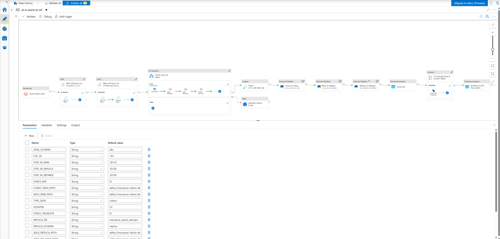
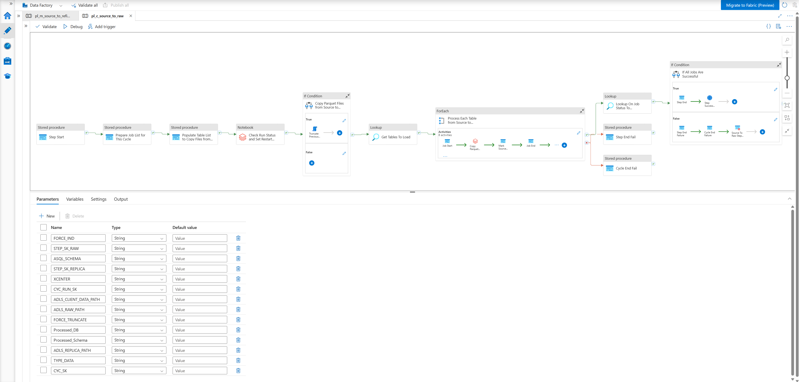
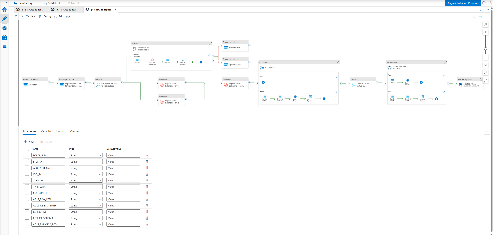
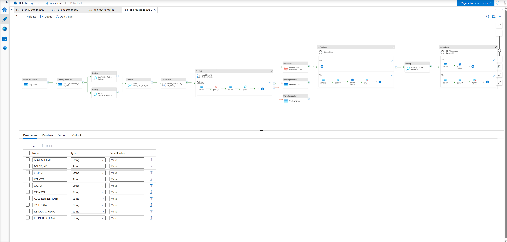
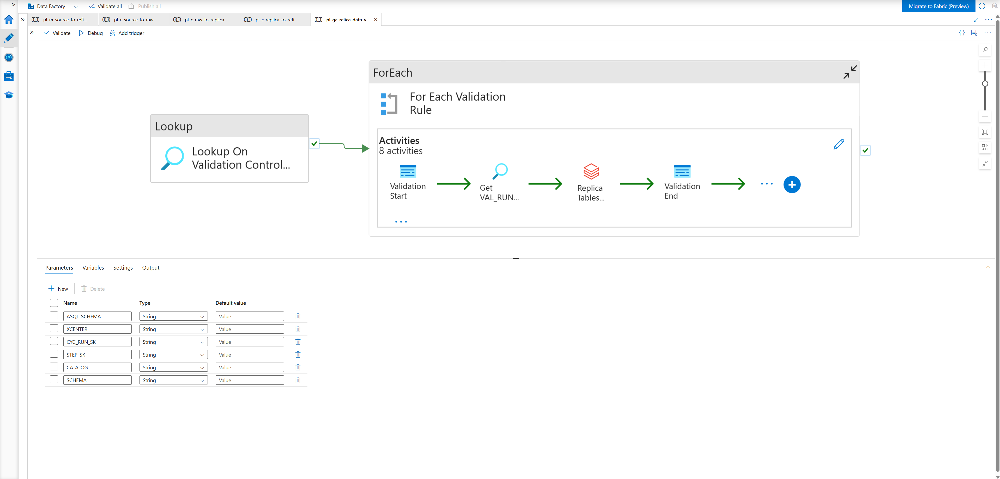
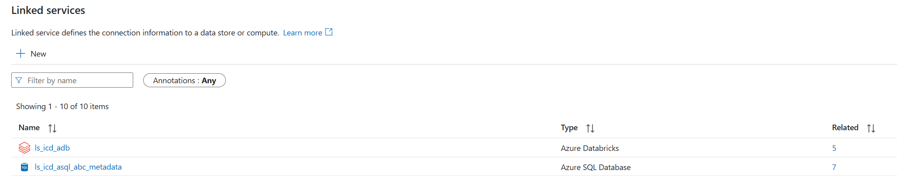
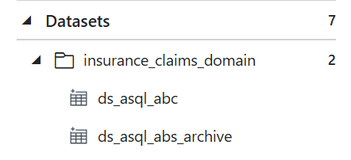
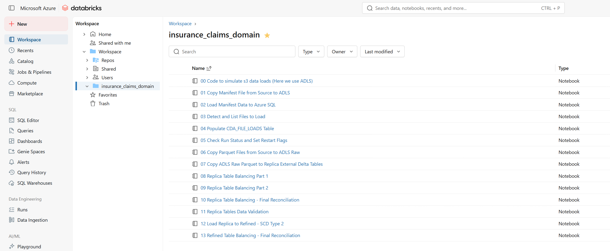
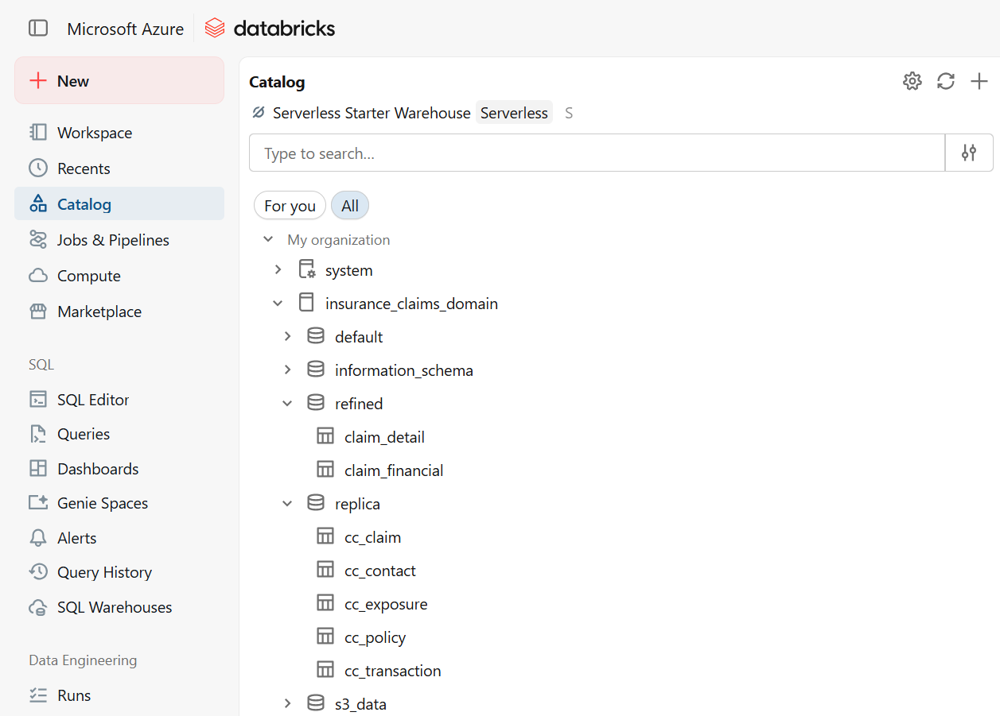

# Pipeline Screenshots

---

## ADF - Master Pipeline (`pl_m_source_to_refined`)

End-to-end orchestration canvas: data generator trigger, cycle guard Until loops, cycle start/end stored procedures, and chained child pipeline calls.

---

## ADF - Source to Raw (`pl_c_source_to_raw`)

Manifest stage (notebooks 01-05) followed by the ForEach activity that runs notebook 06 per table in parallel to copy parquet files into the raw zone.

---

## ADF - Raw to Replica (`pl_c_raw_to_replica`)

ForEach activity running notebook 07 per table (CDC MERGE into replica Delta tables), followed by the three balancing notebooks and the validation sub-pipeline call.

---

## ADF - Replica to Refined (`pl_c_replica_to_refined`)

Prev-cycle lookup, step tracking stored procedures, ForEach activity running notebook 12 (SCD Type 2 MERGE) per refined table, and the final balancing notebook.

---

## ADF - Replica Data Validation (`pl_gc_relica_data_validation`)

Validation sub-pipeline: resets rule statuses via stored procedure, then runs notebook 11 to execute all rules from `abc.VALIDATION_CTRL_TBL` and log failures.

---

## ADF - Linked Services

Configured connections to Azure Databricks (dedicated job clusters for pipeline execution), Azure SQL Database (ABC metadata framework), and ADLS Gen2 (raw/replica/refined zones).

---

## ADF - Datasets

Dataset definitions used by pipeline activities: Azure SQL dataset (`ds_asql_abc`) for metadata table reads/writes, and ADLS datasets for parquet file source and sink operations.

---

## Databricks Workspace

Notebooks imported into the Databricks workspace, showing the full pipeline sequence from the data generator (notebook 00) through to the refined layer balancing (notebook 13).

---

## Databricks - Unity Catalog

Unity Catalog browser showing the `insurance_claims_domain` catalog with `replica`, `refined`, and `analytics` schemas. External Delta tables registered here point to their respective ADLS paths.

